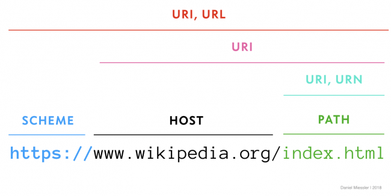
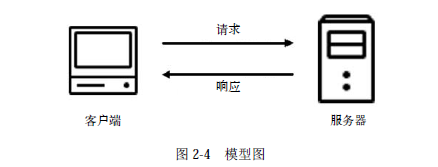
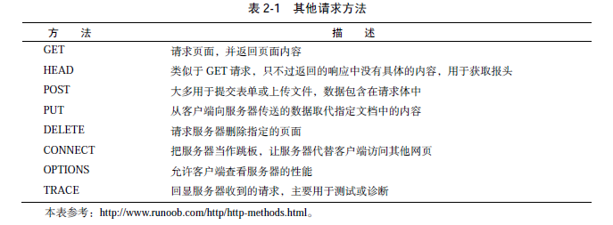
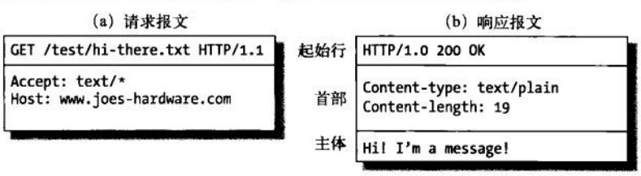
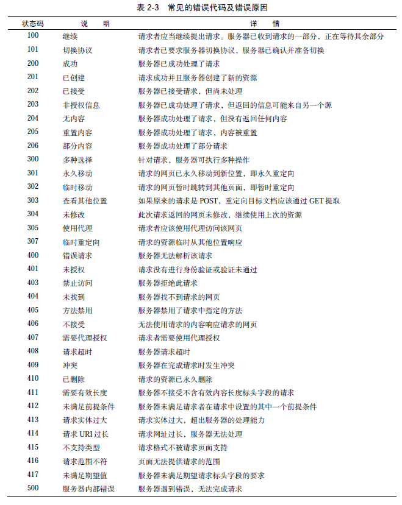

# 第三天

## 爬虫基础知识
1. HTTP原理
2. 网页的基础知识
3. 爬虫基础原理

### URI和URL

URI的全称为Uniform Resource Identifier，即统一资源标志符，URL的全称为Universal Resource Locator，即统一资源定位符举例来说，
https://github.com/favicon.ico 是GitHub的网站图标链接，它是一个URL，也是一个URI。即有这样的一个图标资源，我们用URL/URI来
唯一指定了它的访问方式，这其中包括了访问协议https、访问路径（/即根目录）和资源名称favicon.ico。通过这样一个链接，我们便可以
从互联网上找到这个资源，这就是URL/URI。

URL是URI的子集，也就是说每个URL都是URI，但不是每个URI都是URL。那么，怎样的URI不是URL呢？URI还包括一个子类叫作URN，它的全称
为Universal Resource Name，即统一资源名称。URN只命名资源而不指定如何定位资源，比如favicon.ico只是个文件名称

URI可以分为URL,URN或同时具备locators 和names特性的一个东西。URN作用就好像一个人的名字，URL就像一个人的地址。换句话说：
URN确定了东西的身份，URL提供了找到它的方式。




### http和https

HTTP的全称是Hyper Text Transfer Protocol，中文名叫作超文本传输协议
HTTPS的全称是Hyper Text Transfer Protocol over Secure Socket Layer，是以安全为目标的HTTP通道，简单讲是HTTP的安全版，即HTTP下加入SSL层，简称为HTTPS。

HTTP请求过程



http请求方法

常见的请求方法有两种：GET和POST
其它请求方法



请求报文



状态码




### 网页组成

网页可以分为三大部分——HTML、CSS和JavaScript
HTML是用来描述网页的一种语言，其全称叫作Hyper Text Markup Language，即超文本标记语言。网页包括文字、按钮、图片和视频等各种复杂的元素

不同类型的文字通过不同类型的标签来表示，如图片用img标签表示，视频用video标签表示，段落用p标签表示，它们之间的布局又常通过布局标签div嵌套组合而成，各种标签通过不同的排列和嵌套才形成了网页的框架

HTML定义了网页的结构，但是只有HTML页面的布局并不美观，可能只是简单的节点元素的排列，为了让网页看起来更好看一些，这里借助了CSS。

CSS，全称叫作Cascading Style Sheets，即层叠样式表。“层叠”是指当在HTML中引用了数个样式文件，并且样式发生冲突时，浏览器能依据层叠顺序处理。“样式”指网页中文字大小、颜色、元素间距、排列等格式

JavaScript，简称JS，是一种脚本语言。HTML和CSS配合使用，提供给用户的只是一种静态信息，缺乏交互性。我们在网页里可能会看到一些交互和动画效果，如下载进度条、提示框、轮播图等，这通常就是JavaScript的功劳

### 爬虫基础原理

简单来说，爬虫就是获取网页并提取和保存信息的自动化程序，下面概要介绍一下。

1. 获取网页

爬虫首先要做的工作就是获取网页，这里就是获取网页的源代码。源代码里包含了网页的部分有用信息，所以只要把源代码获取下来，就可以从中提取想要的信息了。

前面讲了请求和响应的概念，向网站的服务器发送一个请求，返回的响应体便是网页源代码。所以，最关键的部分就是构造一个请求并发送给服务器，然后接收到响应并将其解析出来，那么这个流程怎样实现呢？总不能手工去截取网页源码吧？

不用担心，Python提供了许多库来帮助我们实现这个操作，如urllib、requests等。我们可以用这些库来帮助我们实现HTTP请求操作，请求和响应都可以用类库提供的数据结构来表示，得到响应之后只需要解析数据结构中的Body部分即可，即得到网页的源代码，这样我们可以用程序来实现获取网页的过程了。

2. 提取信息

获取网页源代码后，接下来就是分析网页源代码，从中提取我们想要的数据。首先，最通用的方法便是采用正则表达式提取，这是一个万能的方法，但是在构造正则表达式时比较复杂且容易出错。

另外，由于网页的结构有一定的规则，所以还有一些根据网页节点属性、CSS选择器或XPath来提取网页信息的库，如Beautiful Soup、pyquery、lxml等。使用这些库，我们可以高效快速地从中提取网页信息，如节点的属性、文本值等。

提取信息是爬虫非常重要的部分，它可以使杂乱的数据变得条理清晰，以便我们后续处理和分析数据。

3. 保存数据

提取信息后，我们一般会将提取到的数据保存到某处以便后续使用。这里保存形式有多种多样，如可以简单保存为TXT文本或JSON文本，也可以保存到数据库，如MySQL和MongoDB等，也可保存至远程服务器，如借助SFTP进行操作等。

4. 自动化程序

说到自动化程序，意思是说爬虫可以代替人来完成这些操作。首先，我们手工当然可以提取这些信息，但是当量特别大或者想快速获取大量数据的话，肯定还是要借助程序。爬虫就是代替我们来完成这份爬取工作的自动化程序，它可以在抓取过程中进行各种异常处理、错误重试等操作，确保爬取持续高效地运行。


### 静态页面
在网页中我们能看到各种各样的信息，最常见的便是常规网页，它们对应着HTML代码，而最常抓取的便是HTML源代码。

另外，可能有些网页返回的不是HTML代码，而是一个JSON字符串（其中API接口大多采用这样的形式），这种格式的数据方便传输和解析，它们同样可以抓取，而且数据提取更加方便。

此外，我们还可以看到各种二进制数据，如图片、视频和音频等。利用爬虫，我们可以将这些二进制数据抓取下来，然后保存成对应的文件名。

另外，还可以看到各种扩展名的文件，如CSS、JavaScript和配置文件等，这些其实也是最普通的文件，只要在浏览器里面可以访问到，就可以将其抓取下来。

上述内容其实都对应各自的URL，是基于HTTP或HTTPS协议的，只要是这种数据，爬虫都可以抓取。

### 动态页面

有时候，我们在用urllib或requests抓取网页时，得到的源代码实际和浏览器中看到的不一样。

这是一个非常常见的问题。现在网页越来越多地采用Ajax、前端模块化工具来构建，整个网页可能都是由JavaScript渲染出来的，也就是说原始的HTML代码就是一个空壳
比如 https://www.12306.cn/index/

### 带认证的页面

HTTP的一个特点，叫作无状态。HTTP的无状态是指HTTP协议对事务处理是没有记忆能力的，也就是说服务器不知道客户端是什么状态。当我们向服务器发送请求后，服务器解析此请求，然后返回对应的响应，服务器负责完成这个过程，而且这个过程是完全独立的，服务器不会记录前后状态的变化，也就是缺少状态记录。

两个用于保持HTTP连接状态的技术就出现了，它们分别是会话和Cookies。会话在服务端，也就是网站的服务器，用来保存用户的会话信息；Cookies在客户端，也可以理解为浏览器端，有了Cookies，浏览器在下次访问网页时会自动附带上它发送给服务器，服务器通过识别Cookies并鉴定出是哪个用户，然后再判断用户是否是登录状态，然后返回对应的响应。


我们可以理解为Cookies里面保存了登录的凭证，有了它，只需要在下次请求携带Cookies发送请求而不必重新输入用户名、密码等信息重新登录了。

因此在爬虫中，有时候处理需要登录才能访问的页面时，我们一般会直接将登录成功后获取的Cookies放在请求头里面直接请求，而不必重新模拟登录

### 代理的基本原理

我们在做爬虫的过程中经常会遇到这样的情况，最初爬虫正常运行，正常抓取数据，一切看起来都是那么美好，然而一杯茶的功夫可能就会出现错误，比如403 Forbidden，这时候打开网页一看，可能会看到“您的IP访问频率太高”这样的提示。出现这种现象的原因是网站采取了一些反爬虫措施。比如，服务器会检测某个IP在单位时间内的请求次数，如果超过了这个阈值，就会直接拒绝服务，返回一些错误信息，这种情况可以称为封IP

代理实际上指的就是代理服务器，proxy server，它的功能是代理网络用户去取得网络信息。在我们正常请求一个网站时，是发送了请求给Web服务器，Web服务器把响应传回给我们。如果设置了代理服务器，实际上就是在本机和服务器之间搭建了一个桥，此时本机不是直接向Web服务器发起请求，而是向代理服务器发出请求，请求会发送给代理服务器，然后由代理服务器再发送给Web服务器，接着由代理服务器再把Web服务器返回的响应转发给本机。这样我们同样可以正常访问网页，但这个过程中Web服务器识别出的真实IP就不再是我们本机的IP了，就成功实现了IP伪装，这就是代理的基本原理

1. 突破自身IP访问限制，访问一些平时不能访问的站点。

2. 访问一些单位或团体内部资源：比如使用教育网内地址段免费代理服务器，就可以用于对教育网开放的各类FTP下载上传，以及各类资料查询共享等服务。

3. 提高访问速度：通常代理服务器都设置一个较大的硬盘缓冲区，当有外界的信息通过时，同时也将其保存到缓冲区中，当其他用户再访问相同的信息时，则直接由缓冲区中取出信息，传给用户，以提高访问速度。

4. 隐藏真实IP：上网者也可以通过这种方法隐藏自己的IP，免受攻击。对于爬虫来说，我们用代理就是为了隐藏自身IP，防止自身的IP被封锁。

对于爬虫来说，由于爬虫爬取速度过快，在爬取过程中可能遇到同一个IP访问过于频繁的问题，此时网站就会让我们输入验证码登录或者直接封锁IP，这样会给爬取带来极大的不便。

使用代理隐藏真实的IP，让服务器误以为是代理服务器在请求自己。这样在爬取过程中通过不断更换代理，就不会被封锁，可以达到很好的爬取效果。

### 爬虫基础模块

爬虫的第一步就是要模拟浏览器发出请求，python实现http协议的模块有 urllib、requests等常用模块

#### 使用urllib

[urllib](https://docs.python.org/3/library/urllib.html)
文档

在python2中有urllib和urllib2,python3 中统一为urllib。它是python内置的库，不需要额外安装。
urllib包含了4个模块

1. request： 他是最基本的http请求模块，可以用来发送请求，取得相应结果
2. error： 异常处理模块，如果请求出错我们可以捕获异常，进行处理
3. parse： 对url进行处理


##### 发送请求

1. urlopen()
```
from urllib import request

r = request.urlopen("https://www.163.com")
print(r.read().decode('gbk'))
```

r 是个HTTPResponse类的对象，主要包含read()、getheader(name)、getheaders()、info()、等方法，以及msg、version、status、reason等属性

```
from urllib import request

r = request.urlopen("https://www.163.com")
print(r.status)
print(r.getheaders())
print(r.getheader('Server'))
```

最基本的方法可以完成简单的get请求

data参数

data参数是可选的，设置了该参数请求方法就不再是get而是post

发送一个表单请求 application/x-www-form-urlencoded

```
from urllib import request, parse

data = bytes(parse.urlencode({'name': 'test'}), encoding='utf-8')
r = request.urlopen('http://httpbin.org/post', data=data)
print(r.read().decode())
```

timeout参数指定超时时间，单位是秒，如果超过了这个时间还没有得到响应就抛出异常

```
from urllib import request, parse

r = request.urlopen('http://httpbin.org/get', timeout=0.1)
print(r.read().decode())
```
进行异常处理
```
from urllib import request, parse, error

try:
    r = request.urlopen('http://httpbin.org/get', timeout=0.1)
    print(r.read().decode())
except error.URLError as e:
    print(e.reason)
```

2. Request
上面的方法可以完成一些简单的请求如何get和post表单，不能设置header，不支持其它请求方法
如果需要自定义header或put、delete等方法就需要使用Request类来构造一个请求

```
from urllib import request

rt = request.Request('https://python.org')
re = request.urlopen(rt)
print(re.read().decode())
```

自定义header
```
from urllib import request, parse

url = 'http://httpbin.org/post'
headers = {
        'User-Agent': 'Mozilla/4.0',
}
d = {'name': 'test'}
data = bytes(parse.urlencode(d), encoding='utf-8')

req = request.Request(url,data,headers,method='POST')
r = request.urlopen(req)

print(r.read().decode())

```
发送json
```
from urllib import request
import json

headers = {
        'Content-Type': 'application/json',
}
data = json.dumps({'name': 'test'})
rt = request.Request('http://httpbin.org/post', headers=headers, data=bytes(data, encoding='utf-8'))
r = request.urlopen(rt)

print(r.read().decode())

```

##### 解析链接

urlparse

```
from urllib.parse import urlparse

result = urlparse('http://www.baidu.com/inex.html;user?id=5#comment')
print(result)
```

unurlparse

```
from urllib.parse import urlunparse

data = ['http', 'www.baidu.com', 'index.html', 'user', 'a=6', 'comment']
print(urlunparse(data))
```

urljoin

```
from urllib.parse import urljoin

print(urljoin('http://www.baidu.com', 'FAQ.html'))
```

urlencode

```
from urllib.parse import urlencode

d = {'name': 'test'}

print(urlencode(d))
print(bytes(urlencode(d),encoding='utf-8'))
```

#### requests
[requests](http://docs.python-requests.org/zh_CN/latest/user/quickstart.html)
文档

get 请求
```
import requests

r = requests.get("https://www.baidu.com")
print(r.text)
print(r.status_code)
print(r.cookies)
```

带参数的get请求

```
import requests

data = {'name': 'test', 'age': 18}

r = requests.get("http://httpbin.org/get", params=data)
print(r.text)

```

post请求

```
import requests

data = {'name': 'test', 'age': 18}

r = requests.post("http://httpbin.org/post", data=data)
print(r.text)

```

自定义header
```
import requests

r = requests.get('https://www.zhihu.com/explore')
print(r.text)

import requests

headers= {
        'User-Agent': 'Mozilla/5.0 (Windows NT 10.0; WOW64) AppleWebKit/537.36 (KHTML, like Gecko) Chrome/70.0.3538.102 Safari/537.36'
}
r = requests.get('https://www.zhihu.com/explore', headers=headers)

print(r.text)
```

#### html解析库

lxml

```
from lxml import etree

text = '''
<div>
    <ul>
         <li class="item-0"><a href="link1.html">first item</a></li>
         <li class="item-1"><a href="link2.html">second item</a></li>
         <li class="item-inactive"><a href="link3.html">third item</a></li>
         <li class="item-1"><a href="link4.html">fourth item</a></li>
         <li class="item-0"><a href="link5.html">fifth item</a>
     </ul>
 </div>
'''
htmlEmt = etree.HTML(text)
print(htmlEmt)
```

使用xpath定位元素

```
from lxml import etree

text = '''
<div>
    <ul>
         <li class="item-0"><a href="link1.html">first item</a></li>
         <li class="item-1"><a href="link2.html">second item</a></li>
         <li class="item-inactive"><a href="link3.html">third item</a></li>
         <li class="item-1"><a href="link4.html">fourth item</a></li>
         <li class="item-0"><a href="link5.html">fifth item</a>
     </ul>
 </div>
'''
htmlEmt = etree.HTML(text)
print(htmlEmt.xpath("//*"))
```

定位元素
```
print(htmlEmt.xpath("//li"))
print(htmlEmt.xpath("//li/a"))
```

[xpath概念](http://www.w3school.com.cn/xpath/xpath_syntax.asp)

通过属性定位

```
print(htmlEmt.xpath('//li[@class="item-0"]'))
```

获取属性值
```
print(htmlEmt.xpath('//li/@class'))
```

获取文本
```
print(htmlEmt.xpath('//li/a[@href="link1.html"]//text()'))
```

Beautiful Soup

[bs4](https://beautifulsoup.readthedocs.io/zh_CN/v4.4.0/)文档

```
from bs4 import BeautifulSoup

html_doc = """
<html><head><title>The Dormouse's story</title></head>
<body>
<p class="title"><b>The Dormouse's story</b></p>

<p class="story">Once upon a time there were three little sisters; and their names were
<a href="http://example.com/elsie" class="sister" id="link1">Elsie</a>,
<a href="http://example.com/lacie" class="sister" id="link2">Lacie</a> and
<a href="http://example.com/tillie" class="sister" id="link3">Tillie</a>;
and they lived at the bottom of a well.</p>

<p class="story">...</p>
"""

soup = BeautifulSoup(html_doc, 'html.parser')

print(soup.title)
print(soup.p)
print(soup.p['class'])
print(soup.find_all('a'))
```

[css选择器](http://www.w3school.com.cn/cssref/css_selectors.asp)

抓取例子

```
from bs4 import BeautifulSoup
import requests


url = "https://movie.douban.com/"

r = requests.get(url)
html_doc = r.text
soup = BeautifulSoup(html_doc, 'html.parser')

element = soup.select('#billboard > div.billboard-bd > table')[0]
for item in element.find_all('a'):
    print(item.text)


```
### 如何访问有认证的页面
```
import requests
from bs4 import BeautifulSoup

headers= {
        'User-Agent': 'Mozilla/5.0 (Windows NT 10.0; WOW64) AppleWebKit/537.36 (KHTML, like Gecko) Chrome/70.0.3538.102 Safari/537.36'
}
url = "http://116.196.114.148:8000/admin/login/?next=/admin/"
s = requests.session()
r = s.get(url)
bs = BeautifulSoup(r.content, 'html.parser')
e = bs.select('#login-form > input[type=hidden]')
csrftoken = e[0].attrs["value"]

data = {
    "csrfmiddlewaretoken": csrftoken,
    "username": "admin",
    "password": "jia12345",
    "next": "/admin/"

}

rt = s.post(url,headers=headers,data=data)
print(rt.status_code)


```

#### 简单爬虫
```
import requests
from bs4 import BeautifulSoup
import queue

start_page = "http://www.163.com"
domain = "163.com"
url_queue = queue.Queue()
seen = set()

seen.add(start_page)
url_queue.put(start_page)


def sotre(url):
    pass

def extract_urls(url):
    urls = []
    html = requests.get(url)
    soup = BeautifulSoup(html.content, "html.parser")
    for e in soup.findAll('a'):
        url = e.attrs.get('href', '#')
        urls.append(url)
    return urls


while True:

    if not url_queue.empty():

        current_url = url_queue.get()
        print(current_url)
        sotre(current_url)
        for next_url in extract_urls(current_url):
            if next_url not in seen and domain in next_url:
                seen.add(next_url)
                url_queue.put(next_url)
    else:
        break

```

### 作业

爬取最受欢迎电影影评 https://movie.douban.com/review/best/


