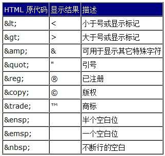
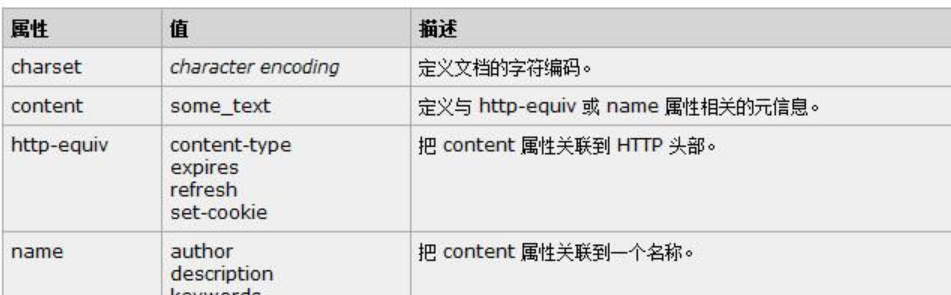
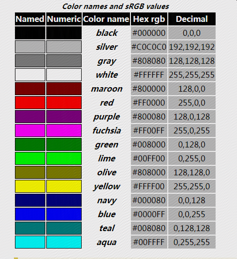

# 第六天 html


## html 基础

HTML 是一种相当简单的、由不同元素组成的标记语言，它可用于表示文本片段，使文本在文档中具有不同的含义（段落、项目列表、表格），将文档结构化为逻辑块（头部、主体、导航菜单），并且可以将图片，影像等内容嵌入到页面中。

HTML由一系列的元素组成, 可以使用它来封装，标记内容的不同部分

```
html入门
html介绍
```

在html中只有使用如下表示才是一个段落

```
<p> html入门</p>
<p> html介绍</p>
```

### html 元素


1. 元素的构成

* 开始标签 `<p>` 表示一个段落的开始
* 结束标签 `</p>` 表示一个段落结束
* 内容 开始标签和结束标签之间的部分
* 元素  开始标签+内容+结束标签 

2. 嵌套元素

元素里可以嵌套另一个元素

`<p>我的<strong>html</strong></p>`

所有的元素都需要正确的打开和关闭

3. 块级元素和内联元素

* 块级元素在页面中以块的形式展现 —— 相对与其前面的内容它会出现在新的一行，其后的内容也会被挤到下一行展现。块级元素通常用于展示页面上结构化的内容，例如段落、列表、导航菜单、页脚等等。一个以block形式展现的块级元素不会被嵌套进内联元素中，但可以嵌套在其它块级元素中

* 内联元素通常出现在块级元素中并包裹文档内容的一小部分，而不是一整个段落或者一组内容。内联元素不会导致文本换行：它通常出现在一堆文字之间例如超链接元素`<a>`或者强调元素`<em>`和 `<strong>`

看下面例子
```
<em>一</em><em>二</em><em>三</em>

<p>四</p><p>五</p><p>六</p>
```

`<em>` 是一个内联元素，所以就像你在下方可以看到的，第一行代码中的三个元素都没有间隙的展示在了同一行。而`<p>`是一个块级元素，所以第二行代码中的每个元素分别都另起了新的一行展现，并且每个段落间都有空行

4. 空元素
不是所有元素都拥有开始标签，内容和结束标签. 一些元素只有一个标签，通常用来在此元素所在位置插入/嵌入一些东西 。例如：元素是用来在元素所在位置插入一张指定的图片。例子如下：
```

```

### 属性
元素可以有属性


属性包含元素的额外信息，这些信息不会出现在实际的内容中。在上述例子中，这个class属性给元素赋了一个识别的名字，这个名字可以css所使用

一个属性必须包含如下内容：

* 在元素和属性之间有个空格 (如果有一个或多个已存在的属性，就与前一个属性之间有一个空格)
* 属性后面紧跟着一个=号
* 有一个属性值,由一对引号""引起来

例子

```
<a href="https://github.com/jiam/python-dev" title="python-dev" target="_blank">教程</a>
```

* href: 这个属性声明超链接的web地址，当这个链接被点击浏览器会跳转至href声明的web地址
* title: 标题title 属性为超链接声明额外的信息
* target: 目标target 属性指定将用于打开链接的方式,target="_blank" 将在新标签页中打开链接


布尔属性

有时你会看到没有值的属性，它是合法的。这些属性被称为布尔属性，他们只能有跟它的属性名一样的属性值。例如 disabled 属性，他们可以标记表单输入使之变为不可用(变灰色)，此时用户不能向他们输入任何数据
```
<input type="text" disabled="disabled">
<input type="text">
```

### html文档结构
```
<!DOCTYPE html>
<html>
  <head>
    <meta charset="utf-8">
    <title>我的测试页</title>
  </head>
  <body>
    <p>这是我的一个页面</p>
  </body>
</html>
```

* `<!DOCTYPE html>`: 声明文档类型
* `<html></html>: <html>`元素。这个元素包裹了整个完整的页面，是一个根元素。  
* `<head></head>: <head>`元素. 这个元素是一个容器，它包含了所有你想包含在HTML页面中但不想在HTML页面中显示的内容。
这些内容包括你想在搜索结果中出现的关键字和页面描述，CSS样式，字符集声明等等。
* `<meta charset="utf-8">`: 这个元素设置文档使用utf-8字符集编码

* `<title></title>`: 设置页面标题，出现在浏览器标签上，当你标记/收藏页面时它可用来描述页面。
* `<body></body>: <body>`元素。 包含了访问页面时所有显示在页面上的内容，文本，图片，音频，游戏等等

### HTML中的空白

无论你用了多少空白(包括空白字符，包括换行), 当渲染这些代码的时候，HTML解释器会将连续出现的空白字符减少为一个单独的空格符

```
<p>Dogs are silly.</p>

<p>Dogs        are
         silly.</p>
```
这面两个写法效果是相同的

### html中的特殊字符

常见特殊字符


### HTML注释
为了将一段HTML中的内容置为注释，你需要将其用特殊的记号`<!--和-->`包括起来， 比如：
```
<p>I'm not inside a comment</p>

<!-- <p>I am!</p> -->
```

### html 元数据



```
<meta charset="utf-8">
<meta http-equiv="X-UA-Compatible" content="IE=edge">
<meta name="application-name" content="Python.org">
```

打开`www.jd.com `查看源代码

### 在HTML中应用CSS和JavaScript

如今，几乎你使用的所有网站都会使用 CSS 让网页更加炫酷, 使用JavaScript让网页有交互功能, 比如视频播放器，地图，游戏以及更多功能。
这些应用在网页中很常见，它们分别使用 `<link>`元素以及` <script> `元素

```
<!-- 本地新闻 -->
<script src="//www.163.com/special/00774J00/index_news_keys.js" charset="gbk"></script>
<!-- 第三方合作新闻推荐 -->
<link href="https://static.ws.126.net/f2e/www/index20170701/collect/head~DIhBY9NJYLhd.css" rel="stylesheet" />
```


### HTML 文字基础

标题、段落
```
<h1>The Crushing Bore</h1>

<p>By Chris Mills</p>

<h2>Chapter 1: The Dark Night</h2>

<p>It was a dark night. Somewhere, an owl hooted. The rain lashed down on the ...</p>

<h2>Chapter 2: The eternal silence</h2>

<p>Our protagonist could not so much as a whisper out of the shadowy figure ...</p>

<h3>The specter speaks</h3>

<p>Several more hours had passed, when all of a sudden the specter sat bolt upright and exclaimed, "Please have mercy on my soul!"</p>
```

无序列表

```
<ul>
  <li>牛奶</li>
  <li>鸡蛋</li>
  <li>面包</li>
  <li>鹰嘴豆泥</li>
</ul>

```
有序列表

```
<ol>
  <li>行驶到这条路的尽头</li>
  <li>向右转</li>
  <li>直行穿过第一个双环形交叉路</li>
  <li>在第三个环形交叉路左转</li>
  <li>学校就在你的右边，300米处</li>
</ol>
```

嵌套列表

```
<ol>
  <li>Remove the skin from the garlic, and chop coarsely.</li>
  <li>Remove all the seeds and stalk from the pepper, and chop coarsely.</li>
  <li>Add all the ingredients into a food processor.</li>
  <li>Process all the ingredients into a paste.
    <ul>
      <li>If you want a coarse "chunky" humous, process it for a short time.</li>
      <li>If you want a smooth humous, process it for a longer time.</li>
    </ul>
  </li>
</ol>
```

斜体字、粗体字、下划线
```
<!-- scientific names -->
<p>
  The Ruby-throated Hummingbird (<i>Archilocus colubris</i>)
  is the most common hummingbird in Eastern North America.
</p>

<!-- foreign words -->
<p>
  The menu was a sea of exotic words like <i lang="uk-latn">vatrushka</i>,
  <i lang="id">nasi goreng</i> and <i lang="fr">soupe à l'oignon</i>.
</p>

<!-- a known misspelling -->
<p>
  Someday I'll learn how to <u>spel</u> better.
</p>

<!-- Highlight keywords in a set of instructions -->
<ol>
  <li>
    <b>Slice</b> two pieces of bread off the loaf.
  </li>
  <li>
    <b>Insert</b> a tomato slice and a leaf of
    lettuce between the slices of bread.
  </li>
</ol>
```

### 表格

```
<table class="dataintable">
<tr>
<th>选择器</th>
<th>例子</th>
<th>例子描述</th>
<th style="width:5%;">CSS</th>
</tr>

<tr>
<td><a href="/cssref/selector_class.asp" title="CSS .class 选择器">.<i>class</i></a></td>
<td>.intro</td>
<td>选择 class=&quot;intro&quot; 的所有元素。</td>
<td>1</td>
</tr>

<tr>
<td><a href="/cssref/selector_id.asp" title="CSS #id 选择器">#<i>id</i></a></td>
<td>#firstname</td>
<td>选择 id=&quot;firstname&quot; 的所有元素。</td>
<td>1</td>
</tr>
</table>
```

### 表单

用户提交数据

```
<form action="http://foo.com" method="get">
  <div>
    <label for="say">What greeting do you want to say?</label>
    <input name="say" id="say" value="Hi">
  </div>
  <div>
    <label for="to">Who do you want to say it to?</label>
    <input name="to" id="to" value="Mom">
  </div>
  <div>
    <button>Send my greetings</button>
  </div>
</form>
```
* action 属性: 数据要提交到额url，在本例中，数据被发送到 —— http://foo.com
* method属性:  提交数据使用的http方法 ，本例get
```
GET /?say=Hi&to=Mom HTTP/1.1
Host: foo.com

POST / HTTP/1.1
Host: foo.com
Content-Type: application/x-www-form-urlencoded
Content-Length: 13

say=Hi&to=Mom
```

发送文件
```
<form method="post" enctype="multipart/form-data">
  <div>
    <label for="file">Choose a file</label>
    <input type="file" id="file" name="myFile">
  </div>
  <div>
    <button>Send the file</button>
  </div>
</form>
```
* enctype 该属性允许指定在提交表单时所生成的请求中的Content-Type的HTTP数据头的值，默认值application/x-www-form-urlencoded。
意思是为发送的数据指定编码格式

校验数据

强制必填
```
<form>
  <label for="choose">Would you prefer a banana or cherry?</label>
  <input id="choose" name="i_like" required>
  <button>Submit</button>
</form
```

required 属性 必填

限制长度
```
<form>
  <div>
    <label for="choose">Would you prefer a banana or a cherry?</label>
    <input id="choose" name="i_like" required minlength="6" maxlength="6">
  </div>
  <div>
    <label for="number">How many would you like?</label>
    <input type="number" id="number" name="amount" value="1" min="1" max="10">
  </div>
  <div>
    <button>Submit</button>
  </div>
</form>
```

### 表单组件

+ 文本输入
```
<input type="text" id="comment" name="comment" value="I'm a text field">
```

+ E-mail 地址
```
<input type="email" id="email" name="email" multiple>
```
通过包括multiple属性，可以让用户将多个电子邮件地址输入相同的输入(以逗号分隔)

+ 密码
```
<input type="password" id="pwd" name="pwd">
```

+ 搜索
```
<input type="search" id="search" name="search">
```
+ 多行文本
```
<textarea cols="30" rows="10"></textarea>
```

+ 下拉选择框
```
<select id="simple" name="simple">
  <option>Banana</option>
  <option>Cherry</option>
  <option>Lemon</option>
</select>
```

+ 多选框
```
<select multiple id="multi" name="multi">
  <option>Banana</option>
  <option>Cherry</option>
  <option>Lemon</option>
</select>
```

+ 复选框
```
<input type="checkbox" checked id="carrots" name="carrots" value="carrots">
```
+ 单选按钮
```
<input type="radio" checked id="soup" name="meal">
```
+ 按钮

提交
```
<button type="submit">
    This a <br><strong>submit button</strong>
</button>

<input type="submit" value="This is a submit button">
```

重置
```
<button type="reset">
    This a <br><strong>reset button</strong>
</button>

<input type="reset" value="This is a reset button">
```

## css
CSS 指层叠样式表 (Cascading Style Sheets),它允许我们将布局和设计添加到html页面，
并且它允许我们从元素到页面共享这些样式。
在我们了解所有功能之前，我们先来了解几个概念

### 选择器
当元素被添加到网页中时，可以使用CSS进行样式化。选择器用来定位HTML中的哪些元素应用样式（例如颜色，大小和位置）
选择器可以包含不同限定符（元素类型，class，id）的组合，以选择独特的元素。例如，我们可能希望选择页面上的每个段落，或者我们可能只想在页面上选择一个特定的段落。
选择器通常以属性值为目标，例如id或class值，或者定位元素的类型，例如`<h1>`或`<p>`

在CSS中，选择器后跟大括号{}，其中包含要应用于所选元素的样式。下面的选择器是针对所有的`<p>`元素
````
p { ... }
````
**属性**

一旦选择了元素，属性将确定将应用于该元素的样式，属性名称位于大括号{}内的选择器之后，紧接在冒号之后：
我们可以使用许多属性，例如背景，颜色，字体大小，高度和宽度，并且通常会添加新属性。
在下面的代码中，我们定义了要应用于所有`<p>`元素的颜色和字体大小属性。
````
p {
  color: ...;
  font-size: ...;
}

````

**值**

到目前为止，我们已经选择了一个带有选择器的元素，并确定了我们想要使用属性的样式。现在我们可以用一个值来确定该属性的行为
值可以被识别为冒号和分号之间的文本。在这里，我们选择所有`<p>`元素，并将color属性的值设置为橙色，并将font-size属性的值设置为16像素。
````
p {
  color: orange;
  font-size: 16px;
}

````

在CSS中，我们的规则集以选择器开头，后面紧跟着大括号。在这些大括号内是由属性和值对组成的声明，每个声明都以一个属性开头，后面跟着冒号，属性值，最后是分号。


**使用选择器**

如前所述，选择器表示对哪些HTML元素进行样式化。充分了解如何使用选择器以及如何利用选择器非常重要。
第一步是熟悉不同类型的选择器。我们将从最常见的选择器开始：类型，类和ID选择器。

Type Selectors

类型选择器按元素类型定位元素。例如，如果我们希望定位所有的div元素，我们将使用div的类型选择器
以下代码显示了除法元素的类型选择器以及它选择的相应HTML

````
# css
div { ... }

# html
<div>...</div>          
<div>...</div>
````

Class Selectors

类选择器允许我们根据元素的类属性值选择一个元素。类选择器比类型选择器更具体，因为它们选择一组特定的元素而不是一种类型的所有元素。类选择器允许我们通过跨多个元素使用相同的类属性值，一次将相同的样式应用于不同的元素。
在CSS中，类由前导点表示，后跟类属性值。下面类选择器将选择包含awesome类属性值的任何元素，包括分割元素和段落元素

````
# css
.awesome { ... }
# html
<div class="awesome">...</div>
<p class="awesome">...</p>
````
ID Selectors

ID选择器比类选择器更精确，因为它们一次只能定位一个独特的元素。就像类选择器使用元素的类属性值作为选择器一样，ID选择器使用元素的id属性值作为选择器。无论它们出现在哪种类型的元素上，每个页面使用的id属性值必须唯一。如果使用它们应该保留用于重要元素。
在CSS中，ID选择符由前导散列符号＃表示，后跟id属性值。这里ID选择器将只选择包含shayhowe的id属性值的元素。

````
# css
#shayhowe { ... }
<div id="shayhowe">...</div>
````
分组选择器
可以选择器进行分组
假设希望 `<h2>` 元素和 `<p>`都是灰色。为达到这个目的，最容易的做法是使用以下声明
```
h2, p {color:gray;}
```
将 `<h2>` 和 `<p>` 选择器放在规则左边，然后用逗号分隔，就定义了一个规则。其右边的样式（color:gray;）将应用到这两个选择器所引用的元素
。逗号告诉浏览器，规则中包含两个不同的选择器。如果没有这个逗号，那么规则的含义将完全不同

[示例](./Chapter-06-code/css-example11.html)

[示例](./Chapter-06-code/css-example12.html)

通配符选择器
通配选择器，显示为一个星号（*）。该选择器可以与任何元素匹配，就像是一个通配符。例如，下面的规则可以使文档中的每个元素都为红色：

[示例](./Chapter-06-code/css-example13.html)

后代选择器

后代选择器（descendant selector）又称为包含选择器。后代选择器可以选择作为某元素后代的元素
我们可以定义后代选择器来创建一些规则，使这些规则在某些文档结构中起作用，而在另外一些结构中不起作用。

举例来说，如果您希望只对 h1 元素中的 em 元素应用样式，可以这样写

[示例](./Chapter-06-code/css-example14.html)

[示例](./Chapter-06-code/css-example15.html)

子元素选择器

如果不希望选择任意的后代元素，而是希望缩小范围，只选择某个元素的子元素，请使用子元素选择器（Child selector）。
例如，如果希望选择只作为 h1 元素子元素的 strong 元素，可以这样写：
[示例](./Chapter-06-code/css-example16.html)

组合选择器
到目前为止，我们已经看过如何分别使用不同类型的选择器，但我们也需要知道如何一起使用这些选择器。通过组合选择器，我们可以更具体地了解我们想要选择的元素或元素组。

例如，假设我们要选择位于具有hotdog class属性值的元素内的所有`<p>`元素，并将其背景颜色设置为棕色。
如果其中一个`<p>`碰巧具有mustard的class属性值，我们希望将其背景颜色设置为黄色。

[示例](./Chapter-06-code/css-example4.html)

当选择器组合时，应该从右到左阅读.最右边的选择器直接位于花括号之前，被称为key选择器。
key选择器确切地标识样式将应用于哪个元素。key 选择器左侧的任何选择器都将用作预选者


### 引用css

+ 外部样式表(External style sheet)
+ 内部样式表(Internal style sheet)
+ 内联样式(Inline style)

#### 外部样式表

为了让我们的CSS对HTML生效，我们需要在我们的HTML中引用我们的CSS文件
引用我们的CSS的最佳做法是将所有样式包含在单个外部样式表中，该样式表从我们的HTML文档的`<head>`元素中引用
使用单个外部样式表可以让我们在整个网站上使用相同的样式，并在整个网站范围内快速进行更改。
其他用于引用CSS的选项包括使用内部样式和内联样式
要创建我们的外部CSS样式表，我们需要创建一个扩展名为.css的文件，我们的CSS文件应保存在我们的HTML文件所在的相同文件夹或子文件夹中

在HTML文档的`<head>`元素中，`<link>`元素用于定义HTML文件和CSS文件之间的关系
因为我们链接到CSS，我们使用rel属性和stylesheet的值来指定它们的关系。
此外，href属性用于标识CSS文件的位置或路径。

考虑下面一个引用单个外部样式表的HTML文档`<head>`元素的例子。
```buildoutcfg
<head>
  <link rel="stylesheet" href="main.css">
</head>

```

为了CSS正确呈现，href属性值的路径必须直接关联到我们的CSS文件保存的位置，
在前面的示例中，main.css文件存储在与HTML文件相同的位置。

如果我们的CSS文件位于子目录或子文件夹内，则href属性值需要相应地与此路径相关联。
例如，如果我们的main.css文件存储在名为stylesheets的子目录中，那么href属性值将是stylesheets/main.css

#### 内部样式表
当单个文档需要特殊的样式时，就应该使用内部样式表。你可以使用 <style> 标签在文档头部定义内部样式表

```
<head>
<style>
hr {border: 5px solid red;}
p {margin-left:20px;}
</style>
</head>
<hr>
<p>内部样式表</p>
```

#### 内嵌样式表
```
<p style="color:sienna;margin-left:20px">这是一个段落。</p>`
```

### 层叠样式
 
我们通过几个例子来了解css是如何层叠渲染页面的。在CSS中，所有样式从样式表顶部到底部分成多层，允许不同的层样式覆盖
例如，假设我们选择样式表顶部的所有`<p>`元素，并将它们的背景颜色设置为橙色，并将它们的字体大小设置为24像素
然后在样式表的底部，我们再次选择所有段落元素，并将其背景颜色设置为绿色，如此处所示

[示例](./Chapter-06-code/css-example1.html)

由于将背景色设置为绿色的段落选择符位于将背景色设置为橙色的段落选择符之后
它将在层叠中优先，所有段落将以绿色背景显示。字体大小将保持24像素，因为第二个段落选择器不能识别新的字体大小。

[示例](./Chapter-06-code/css-example2.html)

层叠样式也适用于单个选择器内的属性。例如，再说一遍，我们选择所有的段落元素并将它们的背景颜色设置为橙色。
然后直接在橙色背景属性和值声明的下方，我们添加另一个属性和值声明，将背景颜色设置为绿色，如示例所示。
由于绿色背景颜色声明位于橙色背景颜色声明之后，因此它将取代橙色背景，并且与以前一样，我们的段落将以绿色背景显示。


### css 颜色
我们已经使用了一些常用的CSS属性值，例如红色和绿色。

CSS中的所有颜色值都是在sRGB（标准的红色，绿色和蓝色）颜色空间中定义的
这个空间内的颜色是通过将红色，绿色和蓝色通道混合在一起形成的，如显示器，电视机
通过混合不同等级的红色，绿色和蓝色，我们可以创造出数百万种颜色，并找到几乎任何我们想要的颜色。

目前，在CSS中有三种主要方式来表示sRGB颜色：名称，十六进制表示法以及RGB

这些名称及其相应的颜色由CSS规范确定。最常见的颜色，都有关键字名称。
这些名称的完整列表可以在CSS规范中找到

[名称](https://www.w3.org/TR/css-color-3/)。



在这里，我们将褐色背景应用于具有task class属性值和将yellow背景应用于具有count class属性值

[示例](./Chapter-06-code/css-example6.html)

```
.task {
  background: maroon;
}
.count {
  background: yellow;
}

```
虽然名字颜色值很简单，但它们提供的选项有限，因此不是最受欢迎的颜色值选择

#### 十六进制颜色值 

十六进制颜色值由一个＃，后跟一个三或六个字符的数字组成。
数字使用数字0到9以及字母a到f，大写或小写。这些值映射到红色，绿色和蓝色
在六个字符的表示法中，前两个字符代表红色通道，第三个和第四个字符代表绿色通道，后两个字符代表蓝色
在三字符表示法中，第一个字符代表红色通道，第二个字符代表绿色通道，最后一个字符代表蓝色

如果以六字符表示，前两个字符是匹配对，第三个和第四个字符是匹配对，并且最后两个字符是匹配对，
则六个字符的数字可以缩短为三个字符的数字，例如，由十六进制颜色＃ff6600表示的橙色阴影也可以写为＃f60。


要从之前创建相同背景颜色，我们可以用十六进制颜色值替换名称颜色值，如此处所示

[示例](./Chapter-06-code/css-example7.html)

```
.task {
  background: #800000;
}
.count {
  background: #ff0;
}

```

#### RGB 颜色值 
RGB颜色值使用rgb（）函数表示，该函数代表红色，绿色和蓝色
该函数接受三个以逗号分隔的值，每个值都是0到255之间的整数。值0将为纯黑色; 255的值将是纯白色的。

如果我们要从前面重新创建一个RGB颜色值的橙色阴影，它将表示为rgb（255,102,0）
第一个代表红色，第二个绿色，三个蓝色
要从之前创建相同背景颜色，我们可以rgb表示

[示例](./Chapter-06-code/css-example8.html)

````
.task {
  background: rgb(128, 0, 0);
}
.count {
  background: rgb(255, 255, 0);
}
````

通过使用rgba（）函数，RGB颜色值还可以包含a透明度。 rgba（）函数需要第四个值，
该值必须是介于0和1之间的值,0表示完全透明的颜色，表示它是不可见的，1表示完全不透明的颜色。 
0到1之间的任何十进制值都会创建半透明颜色。

以下代码将.task背景色设置为25％不透明，并将.count 背景色保留为100％不透明

```
.task {
  background: rgba(128, 0, 0, .25);
}
.count {
  background: rgba(255, 255, 0, 1);
}

```
RGB颜色值越来越流行，尤其是由于能够使用RGBa创建半透明颜色。


目前，十六进制颜色值仍然是最受欢迎的，因为它们得到广泛支持
当需要用于透明度的alpha通道时，RGBa颜色值是优选的

### css长度单位
CSS中的长度有几种不同的值，长度值有两种不同的形式，绝对和相对，每种形式使用不同的度量单位。

#### 像素
绝对长度值是最简单的长度值，因为它们固定为物理测量值，例如英寸，厘米或毫米。
最流行的绝对测量单位称为像素，由px单位表示法表示

像素已经存在了相当长的时间，并且通常与少数不同的属性一起使用。此处的代码使用像素将所有段落的字体大小设置为14像素

````
p {
  font-size: 14px;
}
````

随着观看设备的不断变化和不同的屏幕尺寸，像素已经失去了一些受欢迎程度.作为绝对的度量单位，它们不提供太多的灵活性

#### 百分比

除了绝对长度值之外，还有相对长度值。相对长度值稍微复杂一些，因为它们不是固定的测量单位;它们依赖于另一种测量的长度。

以％单位表示的百分比是最受欢迎的相对值之一，百分比长度是根据另一个对象的长度定义的。
例如，要将元素的宽度设置为50％，我们必须知道其父元素的宽度，它嵌套在其中的元素，然后标识父元素宽度的50％。
```
#main{
 width:50%;
 }
```
在这里，我们将id 为main的元素设置为50％的元素宽度。这50％将相对于元素父级的宽度进行计算（这里相对于屏幕）。

#### em
EM单位也是非常受欢迎的相对价值。 em单位由em单位表示法表示，其长度根据元素的字体大小计算
单个em单元相当于元素的字体大小。如果元素的字体大小为14像素，宽度设置为5em，则宽度将等于70像素（14像素乘以5）

````
.banner {
  font-size: 14px;
  width: 5em;
}
````
当元素的字体大小没有明确规定时，em单位将与最接近的具有规定字体大小的父元素的字体大小相关。
长度的绝对和相对单位比这里提到的要多得多。但是，像素，百分比和em单位是最受欢迎的，也是我们主要使用的

### CSS 文本格式
+ 文本的颜色
+ 文本的对齐方式
+ 文本修饰
+ 文本转换
+ 文本缩进

[教程](https://www.runoob.com/css/css-text.html)


### CSS 字体

+ 字体类型
+ 字体样式
+ 字体大小

### Box Model 盒子模型

现在我们要深入一点，看看网页中元素的显示方式以及它们的大小。

在这个过程中，我们将讨论所谓的盒子模型以及它如何与HTML和CSS一起使用

#### 如何显示元素

究竟如何显示元素，由display属性决定。每个元素都有一个默认的display属性值;
但是，与所有其属性的值一样，该值可能会被覆盖。最常见的是block, inline, inline-block, 和none

每个元素都有默认的display值，根据display的值可分为 块（block）元素，内联（inline）元素和 内嵌（inline-block）元素

block元素独占一行，并且可以设置width,height，margin，padding属性。

inline元素不会独占一行，多个相邻的行内元素会排列在同一行里，直到一行排列不下，才会新换一行，其宽度随元素的内容而变化，
inline元素设置width,height属性无效

inline-block 元素呈现为inline对象，让block元素不再独占一行，多个block元素可以同排一行，且元素具有block的属性，
可设置width、height是block和inline元素的综合体

none 使元素不显示


我们可以通过在CSS中设置显示display的值来更改元素的显示属性值。

[示例](./Chapter-06-code/example1.html)

#### 什么是Box Model(盒子模型)

根据盒子模型概念，页面上的每个元素都是一个矩形框，并且可以具有width(宽度)，height(高度)，padding(填充)，border(边框)和margin(边距)。
*页面上的每个元素都是一个矩形框* 每个页面上的每个元素都符合盒子模型

每个元素都是一个矩形框，并且有width、height、padding、border、margin几个属性决定了该框的大小.

````
div {
  border: 6px solid #949599;
  height: 100px;
  margin: 20px;
  padding: 20px;
  width: 400px;
}

````

根据盒子模型，可以使用下面的公式计算元素的总宽度

````
margin-right + border-right + padding-right + width + padding-left + border-left + margin-left

````

根据盒子模型，元素的总高度可以使用以下公式计算：
````
margin-top + border-top + padding-top + height + padding-bottom + border-bottom + margin-bottom

````
使用公式，我们可以找到示例代码的总高度和宽度

````
Width: 492px = 20px + 6px + 20px + 400px + 20px + 6px + 20px
Height: 192px = 20px + 6px + 20px + 100px + 20px + 6px + 20px
````
盒子模型毫无疑问是HTML和CSS中容易混乱的一部分。我们将width属性值设置为400像素，但元素的实际宽度为492像素
为了确定箱子的实际尺寸，我们需要考虑箱子所有四边的填充，边框和边距

#### Width & Height

每个元素都有默认的宽度和高度。宽度和高度可以是0像素，但默认情况下，浏览器将呈现每个元素的大小.
根据元素的显示方式，默认宽度和高度可能足够.如果元素是页面布局的关键，则可能需要指定的width和height属性值
在这种情况下，可以指定非内联元素的属性值。

元素的默认宽度取决于其显示值。块级元素的默认宽度为100％，占用整个可用的水平空间.
inline和inline-block元素水平扩展和收缩以适应其内容,内联级元素不能具有固定大小，因此宽度和高度属性仅与非内联元素相关
要为非内联元素设置特定宽度，请使用width属性：

````
div {
  width: 400px;
}
````


元素的默认高度由其内容决定,元素将根据需要垂直扩展和收缩以适应其内容.要为非内联元素设置特定高度，请使用height属性：
````
div {
  height: 100px;
}

````
Margin(边距) & Padding(填充)

根据元素的不同，浏览器可以将默认边距和填充应用于元素，以帮助提高易读性和清晰度。
margin属性允许我们设置元素周围的空间量，元素的边距（margin）落在边框（border）之外，并且颜色完全透明。
边距可用于帮助将元素定位在页面上的特定位置，与所有其他元素保持安全距离。
````
div {
  margin: 20px;
}

````

填充（padding）属性与边距（margin）属性非常相似;但是，如果元素具有边框，则它落在元素的边框内。

当涉及边距和填充时，内联（inline）元素的影响与块（block）和内嵌（inline-block）元素略有不同，magin对内联元素（inline）仅在
水平方向起作用即左右。padding在水平和垂直均起作用，但会渗透到上下元素中

#### 设置magrin和padding

````
div {
  margin: 20px;
}
````
以上方式设置元素的4个方向margin值均为20px

如果上下和左右的值不同,设置方式如下
````
div {
  margin: 10px 20px;
}

````

10px 为上下的值，20px为左右的值

如果上下左右各不同。设置方式如下
````
div {
  margin: 10px 20px 0 15px;
}

````

上（top） 10px，右（right）20px，下（bottom）0,左（left）15px  方向为顺时针

也可以单独设置某个方向的值，如：
````
div {
  margin-top: 10px;
  padding-left: 6px;
}

````

边距（magin）和填充（padding）是完全透明的，不接受任何颜色值。但是，它们显示相对元素的背景颜色
对于边距，我们看到父元素的背景颜色，对于填充，我们看到应用填充的元素的背景颜色

#### Borders

边框（border）位于填充（padding）和边距（margin）之间，提供围绕元素的轮廓。
边框（border）属性需要三个值：宽度（width），样式（style）和颜色（color）。
````
div {
  border: 6px solid #949599;
}

````

边框（border）的style常见的有solid, double, dashed, dotted, 和 none

[示例](./Chapter-06-code/example3.html)


单独设置border的各个边，border-top, border-right, border-bottom, 和 border-left
````
div {
  border-bottom: 6px solid #949599;
}

````

另外，可以将各个边界侧的样式控制在更精细的水平。例如，如果我们只希望更改底部边框的宽度，我们可以使用以下代码
````
div {
  border-bottom-width: 12px;
}

````
可选top, right, bottom, 和left

border-radius属性，使我们能够对元素的角进行圆角处理。border-radius属性接受长度单位，包括百分比和像素，用于标识元素的角的半径
````
div {
  border-radius: 5px;
}

````

[示例](./Chapter-06-code/example4.html)

### css定位

**浮动定位**
在页面上定位元素的一种方法是使用float属性。浮动属性非常通用，可以以多种不同方式使用。
从本质上讲，float属性允许我们获取一个元素，将其从页面的正常流中移除，并将其放置在其父元素的左侧或右侧


当float属性同时用于多个元素时，它提供了通过直接相邻或相对浮动元素来创建布局的能力，如多列布局中所示

````
img {
  float: left;
}

````
未使用float属性

[示例](./Chapter-06-code/example5.html)

这里的`<section>`和`<aside>`元素作为块级元素.默认情况下，它们将堆叠在一起
但是，我们希望这些元素并排放置。将`<section>`浮动到左侧，将`<aside>`浮动到右侧
我们可以将它们定位为彼此相对的两列。我们的CSS应该是这样的

````
section {
  float: left;
}
aside {
  float: right;
}
````


作为参考，当一个元素浮动时，它将一直浮动到其父元素的边缘。如果没有父元素，则浮动元素将一直浮动到页面边缘
当我们浮动一个元素时，我们将它从HTML文档的正常流程中取出。这会导致该元素的宽度默认为其中内容的宽度
有时，例如当我们为可重用布局创建列时，不希望出现这种情况.可以通过向每列添加固定宽度属性值来更正它。
另外，为了防止浮动元素彼此接触，导致一个元素的内容直接位于另一个元素的内容旁边，我们可以使用margin属性在元素之间创建空间。
在这里，我们扩展了前面的代码块，为每列添加了边距和宽度，以更好地塑造我们期望的结果
````
section {
  float: left;
  margin: 0 1.5%;
  width: 63%;
}
aside {
  float: right;
  margin: 0 1.5%;
  width: 30%;
}

````

[示例](./Chapter-06-code/example6.html)

浮动可能会更改元素的显示值
浮动元素时，识别元素从页面的正常流中移除也很重要，这可能会更改元素的默认显示值。
float属性依赖于显示值为block的元素，如果元素的默认显示值尚未显示为block元素，则可能会更改该元素的默认显示值。

例如，显示值为inline的元素（例如`<span>`inline元素）将忽略任何height或width属性值
但是，如果inline元素被浮动，其显示值将更改为block，然后它可以接受高度或宽度属性值


有两列我们可以将一列向左浮动而另一列向右浮动，但是如果列数更多，我们必须改变我们的方法
比方说，我们希望在`<header>`和`<footer>`元素之间有一行三列。

如果我们删除<aside>元素并使用三个<section>元素，我们的HTML可能如下所示

````
<header>...</header>
<section>...</section>
<section>...</section>
<section>...</section>
<footer>...</footer>

````

要将这三个`<section>`元素放在一个三列的行中，而不是向左浮动一列，向右浮动一列，我们将所有三个`<section>`元素浮动到左侧。
我们还需要调整`<section>`元素的宽度以考虑其他列，并使它们彼此相邻。
````
section {
  float: left;
  margin: 0 1.5%;
  width: 30%;
}

````
这里我们有三列，所有列都具有相等的宽度和边距值，并且全部浮动到左侧。

[示例](./Chapter-06-code/example7.html)


## js
### [js简介](http://www.runoob.com/js/js-intro.html)
### [dom简介](http://www.runoob.com/js/js-htmldom.html)
### [js操作html](http://www.runoob.com/js/js-htmldom-html.html)
### [js操作css](http://www.runoob.com/js/js-htmldom-css.html)
### [js监听事件](http://www.runoob.com/js/js-htmldom-events.html)
### [js库jquery](http://www.runoob.com/js/js-lib-jquery.html)

## bootstrap
Bootstrap 是全球最受欢迎的前端组件库，用于开发响应式布局、移动设备优先的 WEB 项目。

Bootstrap4 目前是 Bootstrap 的最新版本，是一套用于 HTML、CSS 和 JS 开发的开源工具集。利用我们提供的 Sass 变量和大量 mixin、响应式栅格系统、可扩展的预制组件、基于 jQuery 的强大的插件系统，能够快速为你的想法开发出原型或者构建整个 app 
### [教程](http://www.runoob.com/bootstrap4/bootstrap4-tutorial.html)
### [boostrap-admin实例](https://startbootstrap.com/template-overviews/sb-admin/)

## vue

web框架框架 vue react angularjs
### [vue教程](https://cn.vuejs.org/v2/guide/)
### [vue-admin项目](https://github.com/PanJiaChen/vue-element-admin/blob/master/README.zh-CN.md)