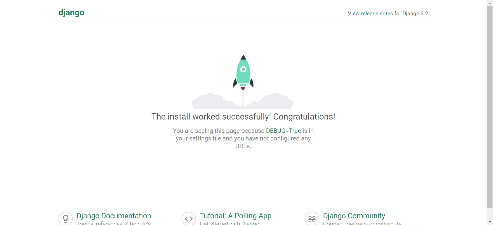
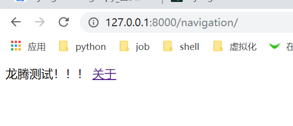
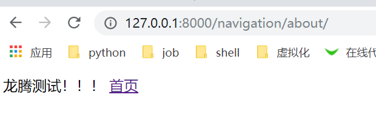
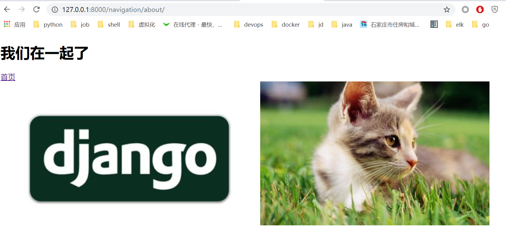
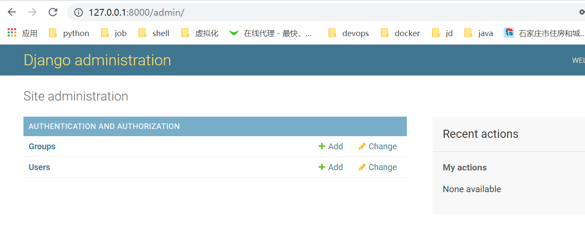
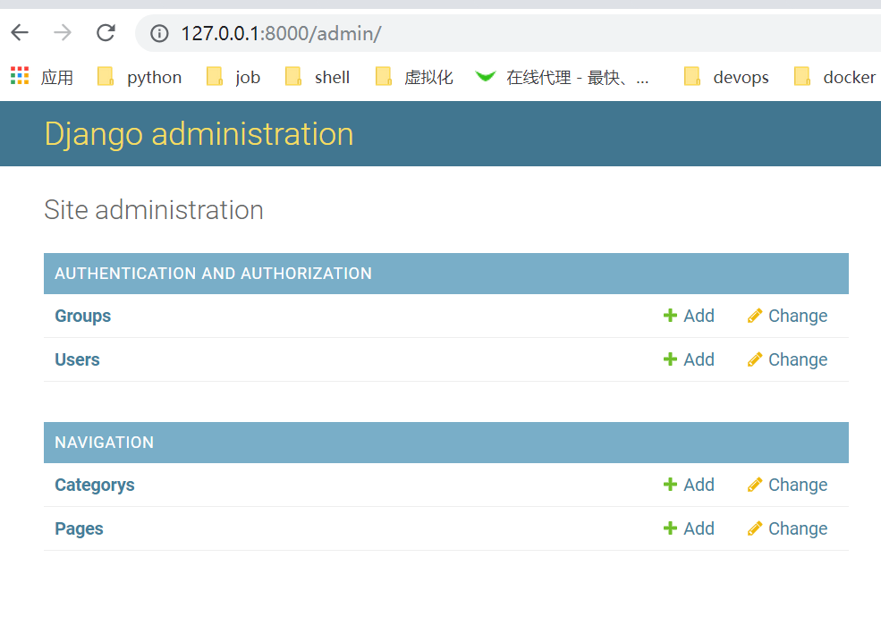

# 第七天
##  Django介绍
Django是一个高级Python Web框架，鼓励快速开发和实用的设计。
由经验丰富的开发人员开发，它可以处理Web开发的大部分问题，
因此可以专注于编写应用程序，而无需重新发明轮子。

Django 特点
1.  快速: Django旨在帮助开发人员尽可能快地完成应用程序
2.  安全: Django严肃对待安全并帮助开发人员避免许多常见的安全错误
3.  可伸缩:  Django快速灵活扩展的能力
4.  丰富的组件: Django 内置各种web开发常用功能组件

## Django安装

使用pip
```
pip install django
```

验证django
```
>>> import django
>>> django.get_version()
'2.2.2'
```

## 创建项目
`django-admin.py startproject first_project`

目录中出现了与项目同名的一个目录，即first_project。在这个目录中你会看到两个内容
+ 另一个与项目同名的目录
+ 一个 Python 脚本，名为 manage.py

我们将把内部那个 first_project 目录称为项目配置目录。在这个目录中，你会看到 4 个 Python 脚本，下面简单介绍一下，后文再详细说明：
1. init__.py：一个空 Python 脚本，存在的目的是告诉 Python 解释器，这个目录是一个Python 包；
2. settings.py：存放 Django 项目的所有设置；
3. urls.py：存放项目的 URL 模式；
4. wsgi.py：用于运行开发服务器和把项目部署到生产环境的一个 Python 脚本。

项目目录中有个名为 manage.py 的文件，在开发过程中时常用到。它提供了一系列维护 Django 项目的命令，例如通过它可以运行内置的 Django 开发服务器，可以测试应用，还可以运行多个数据库命令。几乎每个 Django 命令都要调用这个脚本

[脚本的详细说明](https://docs.djangoproject.com/zh-hans/2.2/ref/django-admin/)

执行 python manage.py help 命令可以查看可用命令列表。

```
python  manage.py help

Type 'manage.py help <subcommand>' for help on a specific subcommand.

Available subcommands:

[auth]
    changepassword
    createsuperuser

[contenttypes]
    remove_stale_contenttypes

[django]
    check
    compilemessages
    createcachetable
    dbshell
    diffsettings
    dumpdata
    flush
    inspectdb
    loaddata
    makemessages
    makemigrations
    migrate
    sendtestemail
    shell
    showmigrations
    sqlflush
    sqlmigrate
    sqlsequencereset
    squashmigrations
    startapp
    startproject
    test
    testserver

[sessions]
    clearsessions

[staticfiles]
    collectstatic
    findstatic
    runserver
```

## 运行测试服务器

```
python manage.py runserver
Watching for file changes with StatReloader
Performing system checks...

System check identified no issues (0 silenced).

You have 17 unapplied migration(s). Your project may not work properly until you apply the migrations for app(s): admin, auth, contenttypes, sessions.
Run 'python manage.py migrate' to apply them.
June 11, 2019 - 21:30:49
Django version 2.2.2, using settings 'first_project.settings'
Starting development server at http://127.0.0.1:8000/
Quit the server with CTRL-BREAK.

```

打开 Web 浏览器，输入 URL http://127.0.0.1:8000/ 你将看到类似下面类似页面


开发服务器随时可以停止，只需在终端或命令提示符窗口中按 CTRL+C 键。如果想在其他端口上运行开发服务器，或者允许其他设备访问，可以提供可选的参数。例如下述命令
`python manage.py runserver 0.0.0.0:5555`

设置端口时，不要使用 80 或 8080，这一般是为 HTTP 保留的。此外，低于 1024 的端口是操作系统专属的。

## 创建django应用
一个 Django 项目中包含一系列配置和应用，这些在一起共同构成一个完整的 Web 应用或网站。这样做便于运用优秀的软件工程实践。把一个 Web 应用分解为多个小应用的好处是，可以把那些小应用放到别的 Django 项目中，无需做多少改动就能使用。

一个 Django 应用完成一件特殊的任务。一个网站需要多少应用，要视其功能而定。例如，一个项目中可能包含一个投票应用、一个注册应用和一个与内容有关的应用。在另一个项目中，我们可能想复用投票和注册应用，因此可以把它们拿过来用。

在 Django 项目所在的目录中执行下述命令

`python manage.py startapp navigation`

startapp 目录在项目的根目录中创建一个新目录，这个目录名为navigation，其中包含一些 Python 脚本：
1. __init__.py：与前面那个的作用完全一样；
admin.py：注册模型，让 Django 为你创建管理界面；
2. apps.py：当前应用的配置；
3. models.py：存放应用的数据模型，即数据的实体及其之间的关系；
4. tests.py：存放测试应用代码的函数；
5. views.py：存放处理请求并返回响应的函数；
6. migrations 目录：存放与模型有关的数据库信息。

views.py 和 models.py 是任何应用中都有的两个文件，是 Django 所采用的设计模式（即“模型-视图
-模板”模式）的主要部分。

在动手创建模型和视图之前，必须告诉 Django 项目这个新应用的存在。为此，要修改项目配置目
录中的 settings.py 文件。打开那个文件，找到 INSTALLED_APPS 列表，把 navigation 添加到末尾：
```
INSTALLED_APPS = [
    'django.contrib.admin',
    'django.contrib.auth',
    'django.contrib.contenttypes',
    'django.contrib.sessions',
    'django.contrib.messages',
    'django.contrib.staticfiles',
    'navigation',
]
```

再次运行开发服务器，确认 Django 识别了这个新应用。如果能正常启动开发服务器，没有任何错误，说明新应用已经成功识别，可以进入下一步了。

## 编写视图

创建好 navigation应用后，下面编写一个简单的视图。这是我们编写的第一个视图，简单起见，暂不使用模型或模板，而是把一些文本发回给客户端。
打开新建的 navigation 目录里的 views.py 文件。
清空文件然后，写入下述代码

```
from django.http import HttpResponse

def index(request):
    return HttpResponse("龙腾测试！！！")
```

下面分析一下这三行代码，看这个简单的视图是如何运作的：
1. 首先，从 django.http 模块中导入 HttpResponse 对象。
2. 在 views.py 文件中，一个函数就是一个视图。这里我们只编写了一个视图，即 index。
3. 视图函数至少有一个参数，即一个 HttpRequest 对象，它也在 django.http 模块中。按约
定，这个参数名为 request，不过你可以根据自己的意愿随意使用其他名称。
4. 视图必须返回一个 HttpResponse 对象。简单的 HttpResponse 对象的参数是一个字符串，表
示要发给客户端的页面内容。

有了视图还不行，为了让用户能访问视图，要把一个统一资源定位地址（ Uniform Resource Locator， URL）映射到视图上。
为此，打开项目配置目录中的 urls.py 文件，在 urlpatterns 中添加一行代码：

```
from django.contrib import admin
from django.urls import path

from navigation import views
urlpatterns = [
    path('admin/', admin.site.urls),
    path('', views.index, name='index'),
]
```

新加的那行代码把根 URL 映射到 navigation 应用的 index 视图上。启动开发服务器（ python
manage.py runserver），访问 http://127.0.0.1:8000 或你指定的其他地址。你将看到 index 视图渲染的输出。

## 映射视图

为了提升模块化程度，我们可以换种方式把入站 URL 映射到视图上，而不直接在项目层设置。首
先，要修改项目的 urls.py 文件，把针对 navigation 应用的请求交给 navigation 应用处理。然后，在 navigation应用中指定如何处理请求。

首先，打开项目配置目录中的 urls.py 文件。相对项目目录而言，这个文件的地址first_project/urls.py。把 urlpatterns 列表改成下面这样：

```
from django.contrib import admin
from django.urls import path, include

from navigation import views
urlpatterns = [
    path('admin/', admin.site.urls),
    path('', views.index, name='index'),
    path('navigation/', include('navigation.urls'))
]
```
可以看出， urlpatterns 是个 Python 列表。新增的映射寻找能匹配navigation的 URL。遇到这样的 URL 时， navigation/ 后面的部分传给 navigation，由 navigation.urls 处理。这一步是通过django.conf.urls 模块中的 include() 函数实现的

这是一种分段处理 URL 字符串的方式，这里，完整的 URL 先去掉域名，余下的
部分（ navigation/）first_project 项目，找到匹配的映射后，再把 navigation/ 去掉，把空字符串传给 navigation 应用处理。

根据上述设置，我们要在 navigation 应用的目录中新建 urls.py 文件，让它处理余下的 URL（即把空字符串映射到 index 视图上）：
```
from django.urls import path

from . import views

urlpatterns = [
    path('', views.index, name='index'),
]
```

这段代码先导入 Django 处理 URL 映射的path函数和 navigation 应用的 views 模块，然后在 urlpatterns列表中调用 path函数映射 index 视图

现在，重启 Django 开发服务器，然后访问http://127.0.0.1:8000/navigation/ 可以看到文本“龙腾测试！！！”

## 回顾基本流程
1. 创建 Django 项目
+ 执行 python django-admin.py startproject <name> 命令，其中 <name> 是想创建的项目名
称。
2. 创建 Django 应用
+ 执行 python manage.py startapp <appname> 命令，其中 <appname> 是想创建的应用名称。
+ 把应用名称添加到项目配置目录中的 settings.py 文件里，放到 INSTALLED_APPS 列表的末
尾，告诉 Django 项目这个应用的存在。
+ 在项目的 urls.py 文件中添加一个映射，指向新建的应用。
+ 在应用的目录中新建 urls.py 文件，把入站 URL 与视图对应起来。
+ 在应用的 view.py 文件中编写所需的视图，确保视图返回一个 HttpResponse 对象。

## 练习
再编写一个视图函数，名为 about，返回“这是关于页面”。
1. 把这个视图映射到 URL /navigation/about/ 上。只需编辑 navigation 应用的 urls.py 文件。记住， /navigation/ 部分由项目的 urls.py 文件处理。
2. 修改 index 视图中的 HttpResponse 对象，加入一个指向关于页面的链接。
3. 在 about 视图的 HttpResponse 对象中添加一个指向主页的链接。

提示

提示链接可以使用` <a href='/navigation/about/'>关于</a>`

效果如下图



## 答案
```
# views.py内容

from django.http import HttpResponse

def index(request):
    return HttpResponse("龙腾测试！！！ <a href='/navigation/about/'>关于</a>")

def about(request):
    return HttpResponse("龙腾测试！！！ <a href='/navigation/'>首页</a>")

# navigation/urls.py内容
from django.urls import path

from . import views

urlpatterns = [
    path('', views.index, name='index'),
    path('about/', views.about, name='about'),
]
```

## 模板

目前，我们只把一个 URL 映射到一个视图上。然而， Django 框架采用的是“模型-视图-模板”架构。现在说明模板与视图的关系，后面再讨论如何与模型联系起来。

为什么使用模板？网站中的不同页面通常使用相同的布局，提供通用的页头（ header）和页脚（ footer），为用户呈现导航，体现一种一致性。 Django 模板能让开发者轻易实现这样的设计要求，而且还能把应用逻辑（视图代码）与表现（应用的外观）区分开。下面将创建一个简单的模板，用于生成 HTML 页面，交由 Django 视图调度。


Django 的模板可以理解为构建完整的 HTML 页面所需的骨架。模板中有静态内容（不变的部分），也有特殊的句法（动态内容，即模板标签）。 Django 视图会把动态内容替换成真正
的数据，生成最终的 HTML 响应。

### 配置模板目录

在项目目录新建一个templates的目录，该目录与manage.py 在同一级，在templates中再创建一个目录名字为navigation，在里面存放navigation应用要使用的模板文件

接下来要告诉 Django 你把模板放在什么位置。打开项目的 settings.py 文件，找到 TEMPLATES 默认内容：

```
TEMPLATES = [
    {
        'BACKEND': 'django.template.backends.django.DjangoTemplates',
        'DIRS': [],
        'APP_DIRS': True,
        'OPTIONS': {
            'context_processors': [
                'django.template.context_processors.debug',
                'django.template.context_processors.request',
                'django.contrib.auth.context_processors.auth',
                'django.contrib.messages.context_processors.messages',
            ],
        },
    },
]
```

为了告诉 Django，模板在何处，我们要修改 DIRS 列表（默认为空）。把这个键值对改成下面这样

`'DIRS': ['D:\python\python-dev\Chapter-07-code\first_project\templates']`

注意，这里使用绝对路径（ absolute path）。然而，与团队成员协作，或者换台电脑的话，这就是个问题了。用户名和磁盘结构变了，目录的路径也就不一样了

硬编码路径是自找麻烦。硬编码路径是软件工程的一种反模式，会导致项目不易移植，也就是说在一台电脑中运行好好的，换台设备可能就会出错。

使用动态路径

更好的方法是使用 Python 内置的函数自动找出 templates 目录的路径。这样无论你把 Django 项目的代码放在何处，最终都能得到一个绝对路径。因此，项目的可移植性更高。

settings.py 文件的顶部有个名为 BASE_DIR 的变量，它的值是 settings.py 文件所在目录的路径。这里用到了 Python 的特殊属性 __file__，它的值是所在文件的绝对路径。调用 os.path.dirname()的作用是获取 settings.py 文件所在目录的绝对路径，再调用一次 os.path.dirname() 又去掉一层，
因此 BASE_DIR 最终的值是项目目录。

有了 BASE_DIR 之后，我们便可以轻易引用 Django 项目中的文件和目录。我们可以定义一个名为TEMPLATE_DIR 的变量，指向 templates 目录的位置。这里还要使用 os.path.join() 函数拼接多个路径片段。 TEMPLATE_DIR 变量的定义如下：
`TEMPLATE_DIR = os.path.join(BASE_DIR, 'templates')`

然后把把 DIRS 键值对改成下面这样：
`'DIRS': [TEMPLATE_DIR, ]`

最终settings.py 中的TEMPLATES部分变为
```
TEMPLATE_DIR = os.path.join(BASE_DIR, 'templates')
TEMPLATES = [
    {
        'BACKEND': 'django.template.backends.django.DjangoTemplates',
        'DIRS': [TEMPLATE_DIR,],
        'APP_DIRS': True,
        'OPTIONS': {
            'context_processors': [
                'django.template.context_processors.debug',
                'django.template.context_processors.request',
                'django.contrib.auth.context_processors.auth',
                'django.contrib.messages.context_processors.messages',
            ],
        },
    },
]
```

### 添加一个模板

模板目录和路径设置好之后，在 templates/navigation/ 目录中创建一个文件，命名为 index.html。在这个新文件中写入下述 HTML 代码。

```
<!DOCTYPE html>
<html>
<head>
<title>navigation</title>
</head>
<body>
<h1>django says...</h1>
<div>
这是第一个页面 <br />
<strong>{{ boldmessage }}</strong><br />
</div>
<div>
<a href="/navigation/about/">关于</a><br />
</div>
</body>
</html>
```

这段 HTML 代码很好理解，最终得到的 HTML 页面将向用户打个招呼。你可能注意到了，这里
有些内容不是 HTML，而是 {{ boldmessage }} 形式。这是 Django 模板变量。我们可以为这样的
变量设值，这样渲染模板后便会显示我们设定的值。稍后再做。

为了使用这个模板，我们要调整一下前面编写的 index() 视图，不再分发一个简单的响应对象，
而是分发这个模板。

打开 navigation/views.py 文件，修改为以下内容

 ```
from django.http import HttpResponse
from django.shortcuts import render
def index(request):
    # 构建一个字典，作为上下文传给模板引擎
    # 注意， boldmessage 键对应于模板中的 {{ boldmessage }}
    context_dict = {'boldmessage': "女神, 屌丝, pythoner"}
    # 返回一个渲染后的响应发给客户端
    # 为了方便，我们使用的是 render 函数的简短形式
    # 注意，第二个参数是我们想使用的模板
    return render(request, 'navigation/index.html', context=context_dict)

def about(request):
    return HttpResponse("龙腾测试！！！ <a href='/navigation/'>首页</a>")
 ```


首先，构建一个字典，设定要传给模板的数据。然后，调用 render() 辅助函数。这个函数的参数
是 request 对象、模板的文件名和上下文字典。 render() 函数将把上下文字典中的数据代入模
板，生成一个完整的 HTML 页面，作为 HttpResponse 对象返回，分发给 Web 浏览器

我们已经更新视图，用上了模板。现在启动 Django 开发服务器，然后访问 http://127.0.0.1:8000/
navigation/。你应该能看到这个简单的 HTML 模板渲染出来了

## 静态文件

尽管我们用上了模板，但是不得不承认， navigation 应用现在还有点简陋，没有样式也没有图像装
饰。为了改善这种状况，我们可以在 HTML 模板中引用其他文件，例如层叠样式表（ Cascading
Style Sheet， CSS）、 JavaScript 和图像。这些是静态文件（ static file），因为它们不是由 Web 服
务器动态生成的，而是原封不动发给 Web 浏览器。接下来说明配置静态文件的方式，以及
如何在模板中添加一个图像

### 配置静态文件目录

首先要指定一个目录，用于存放静态文件。在项目配置目录中新建一个目录，名为 static，然后在static 目录中再新建一个目录，名为 images。确保 static 目录与前面创建的 templates 目录位于同一级。然后，在 images 目录中放一个图像。

首先，在 settings.py 文件的顶部定义一个变量，名为 STATIC_DIR。 STATIC_DIR 的值也应该使用前面用过的
os.path.join，不过这一次是指向 static 目录，如下所示：

`STATIC_DIR = os.path.join(BASE_DIR, 'static')`
将上面配置追加到setings.py文件

定义好这个变量之后，还要创建一个数据结构，名为 STATICFILES_DIRS。这个数据结构的值是一系列路径，让
Django 在其中寻找静态文件。默认情况下， settings.py 文件中没有这个列表。
`STATICFILES_DIRS = [STATIC_DIR, ]`

简单来说， STATIC_DIR 和 STATICFILES_DIRS 两个变量设定静态文件在电脑中的位置； STATIC_URL 变量则指定启动 Django 开发服务器后通过什么URL访问静态文件。例如，把 STATIC_URL 设为 /static/ 后，我们可以通过 http://127.0.0.1:8000/static/
访问里面的静态内容。比如这个图片http://127.0.0.1:8000/static/images/django.jpg

### 在模板中引用静态文件

我们已经做好设置， Django 项目能处理静态文件了。现在可以在模板中利用静态文件改进外观及
增添功能了。下面说明如何引用静态文件。打开templates/navigation/ 目录中的 index.html 模板，参照
下述代码修改。为了方便查找，新增的行旁边有注释。

```
<!DOCTYPE html>
 <!-- 新增 -->
<html>
  <head>
    <title>navigation</title>
  </head>
  <body>
    <h1>django说...</h1>
    <div>
       大家好! <br />
       <strong>{{ boldmessage }}</strong><br />
    </div>
    <div>
      <a href="/navigation/about/">关于</a><br />
       <!-- 新增 -->
    </div>
  </body>
</html>
```

新增的第一行（ ）告诉 Django 模板引擎，我们将在模板中使用静态文
件。这样便可以在模板中使用 static 模板标签引入静态目录中的文件。 `` 告诉 Django，我们想显示静态目录中名为 images/django.jpg 的图像。 static 标签会在images/django.jpg 前加上 STATIC_URL 指定的 URL，得到 /static/images/django.jpg。 Django 模板引擎生成的 HTML 如下：

``

修改视图之后，启动 Django 开发服务器.

只要想在模板中引用静态文件，就可以使用  模板标签。下述代码片段说明如何
在模板中引入 JavaScript、 CSS 和图像。

```
<!DOCTYPE html>
 
<html>
  <head>
    <title>navigation</title>
    <!-- CSS -->
    <link rel="stylesheet" href="" />
    <!-- JavaScript -->
    <script src=""></script>
  </head>
  <body>
    <h1>django说...</h1>
    <div>
       大家好! <br />
       <strong>{{ boldmessage }}</strong><br />
    </div>
    <div>
      <a href="/navigation/about/">关于</a><br />
       
    </div>
  </body>
</html>
```

显然， static 目录中要有你引用的静态文件。如果引用的文件不存在，或者未正确引用，
Django 开发服务器在控制台中的输出将报告 HTTP 404 错误。

## 媒体文件

应用中的静态文件。有时还要使用媒体文件（ media file）。这类文件可由用户或管理员上传。比如说，用户的头像就是媒体文件，电商网站中的商品图片也是媒体文件

### 配置媒体文件目录

指定一个目录，用于存放媒体文件。在项目配置目录中新建一个目录，名为 media，确保media目录与前面创建的static目录位于同一级。然后，在目录中放一个图像cat.jpg

打开 Django 项目配置目录中的 settings.py 模块。我们将在这个文件中添加一些内容。与静
态文件一样，媒体文件也放在文件系统中专门的一个目录中。因此，要告诉 Django 这个目录的位
置。在 settings.py 文件中加上以下配置

`MEDIA_DIR = os.path.join(BASE_DIR, 'media')`

这一行告诉 Django，媒体文件将上传到 Django 项目根目录中的 media 目录里
然后在 settings.py 中找个地方添加两个变量： MEDIA_ROOT 和 MEDIA_URL。 Django 伺服媒体文件时会
用到这两个变量。

```
MEDIA_ROOT = MEDIA_DIR
MEDIA_URL = '/media/'
```

MEDIA_ROOT 变量告诉 Django 在哪里寻找上传的媒体文件， MEDIA_URL 变量则指明通过什么 URL 范根媒体文件。这样设置之后，上传的 cat.jpg 文件在 Django 开发服务器中将通过 http://localhost:8000/media/cat.jpg 访问。会出现404错误

### 配置url
在开发环境中伺服媒体文件的最后一步是，让 Django 使用 MEDIA_URL 伺服媒体内容。打开项目的
urls.py 模块，修改 urlpatterns 列表，调用 static() 函数：
```
urlpatterns = [
...
...
] + static(settings.MEDIA_URL, document_root=settings.MEDIA_ROOT)

```

还要添加
```
from django.conf import settings
from django.conf.urls.static import static
```
再次访问http://localhost:8000/media/cat.jpg

在页面引用媒体文件

找到 settings.py 文件中的 TEMPLATES 列表，里面嵌套着 context_processors 列表。在
context_processors 列表中添加一个处理器， django.template.context_processors.media。添加
之后， context_processors 列表应该类似下面这样
```
'context_processors': [
                'django.template.context_processors.debug',
                'django.template.context_processors.request',
                'django.contrib.auth.context_processors.auth',
                'django.contrib.messages.context_processors.messages',
                'django.template.context_processors.media',
            ],
```
现在可以通过 /media/ URL 访问 media 目录中的媒体文件了

## 回顾基本流程
使用模板
1. 首先，创建要使用的模板，保存到 templates 目录中（在项目的 settings.py 模块中设定）。模板中可以使用 Django 模板变量（例如 {{ variable_name }}）或模板标签。模板变量的值在相应的视图中设定。
2. 在应用的 views.py 文件中找到所需的视图，或者新建一个。
3. 把视图相关的逻辑写在视图函数中。例如，从数据库中检索数据，存到列表中。
4. 在视图中构建一个字典，通过模板上下文传给模板引擎。
5. 使用 render() 辅助函数生成响应。这个函数的参数是请求对象、模板文件名和上下文字典。
6. 如果还没把视图映射到 URL 上，修改项目的 urls.py 文件和应用的 urls.py 文件

引用静态文件
1. 把想用的静态文件放到项目的 static 目录中。这个目录在项目的 settings.py 模块中的STATICFILES_DIRS 列表中设定。
2. 在模板中引用静态文件。例如，图像通过  标签插入 HTML 页面。
3. 记得在模板中加上 ，然后使用  标签引用静态文件。把 <filename> 替换成图像或其他资源的路径。只要想引用静态文件，使用static 模板标签

配置媒体文件
把媒体文件放到项目的 media 目录中。这个目录由项目的 settings.py 模块中的 MEDIA_ROOT变量设定。

## 练习
1. 让关于页面也使用模板渲染，模板名为 about.html。
2. 在 about.html 模板中引入一个图片（存储在项目的 static 目录中）。
3. 在关于页面中添加一行：我们在一起了。
4. 在 Django 项目配置目录中新建一个目录，命名为 media。从网上下载一张猫的图片，保存到 media 目录中，命名为 cat.jpg。
5. 在 about.html 模板中添加一个  标签，显示那个猫的图片。

如下图


## 答案
```
# about 视图函数
def about(request):
    #return HttpResponse("龙腾测试！！！ <a href='/navigation/'>首页</a>")
    return render(request, 'navigation/about.html')

# about.html模板
<!DOCTYPE html>
 
<html>
  <head>
    <title>about</title>
  </head>
  <body>
    <h1>我们在一起了</h1>
    
    <div>
      <a href="/navigation/">首页</a><br />
       
       
    </div>
  </body>
</html>
```

## 模型与数据库

说到数据库，你往往会想到结构化查询语言（ Structured Query Language， SQL），这是从数据库中查询所需数据的常用工具。然而在Django 中，查询底层数据库这项操作由对象关系映射器（ Object Relational Mapper， ORM）负责。在 ORM 中，存储在一个数据库表中的数据封装为一个模型。模型则是描述数据库表中数据的 Python 对象。 Django 不直接通过 SQL 查询数据库，而是使用相应的 Python 模型对象操纵。

接下来介绍使用 Django 及其 ORM 管理数据的基础知识。你会发现，通过 ORM 添加、修改和删除底层数据库中的数据特别简单，而且把数据库中的数据检索出来提供给 Web 浏览器使用也十分方便

### 设置数据库
创建模型之前要设置数据库。新建项目时， Django 已经自动在 settings.py 模块中添加了 DATABASES
变量，其值类似下面这样：

```
DATABASES = {
    'default': {
        'ENGINE': 'django.db.backends.sqlite3',
        'NAME': os.path.join(BASE_DIR, 'db.sqlite3'),
    }
}
```

可以看到， default 数据库由一个轻量级数据库引擎驱动，即 SQLite（见 ENGINE 键）。 NAME 键的值是数据库文件的路径，默认为 Django 项目根目录中的 db.sqlite3

Django 数据库框架支持多种不同的数据库引擎，例如 PostgresSQL、 MySQL 和微软的 SQLServer。使用这些数据库引擎时，可以使用 USER、 PASSWORD、 HOST 和 PORT 等键配置。实战课程中我们会使用mysql，现在使用默认的SQLite

### 创建模型

在 settings.py 模块中配置好数据库之后，下面创建 navigation 应用所需的两个数据模型。 Django 应用的模型保存在应用目录中的 models.py 模块里。因此， navigation 应用的模型保存在 navigation/models.py文件中。我们要定义两个类，一个类对应一个模型。这两个类都要继承基类 django.db.models.Model，分别表示分类和网页。参照下述代码片段定义 Category 和 Page 模型

```
from django.db import models

# Create your models here.
class Category(models.Model):
    name = models.CharField(max_length=128, unique=True)
    def __str__(self): 
        return self.name


class Page(models.Model):
    category = models.ForeignKey(Category, on_delete=models.CASCADE)
    title = models.CharField(max_length=128)
    url = models.URLField()
    views = models.IntegerField(default=0)
    def __str__(self):
        return self.title
```
定义模型时，要指定字段及其类型，并提供必须或可选的参数。默认情况下，每个模型都有一个
自增整数字段，名为 id。这个字段自动分配，用作主键。
model 中用到的几个字段
1. CharField：存储字符数据（如字符串）的字段。 max_length 参数指定最多可存储的字符数。
2. URLField：类似于 CharField，不过是专用于存储 URL 的。也可指定 max_length 参数。
3. IntegerField：存储整数。
4. DateField：存储 Python datetime.date 对象。

此外，各字段还可指定其他参数，例如通过 default='value' 设定默认值。on_delete 关联数据删除时执行的动作,models.CASCADE既当Page所属的Category删除时,同时删除Page

为了建立模型之间的关系， Django 提供了三个字段类型，分别是：
1. ForeignKey：用于建立一对多关系。
2. OneToOneField：用于建立一对一关系。
3. ManyToManyField：用于建立多对多关系。

在我们定义的模型中， Page 模型中的 category 字段是 ForeignKey 类型。我们在字段的构造方法中指定，与 Category 模型建立一对多关系

### 创建和迁移数据库

在 models.py 中定义好模型之后，可以让 Django 在底层数据库中创建表了。为此，Django 提供了迁移工具，让它帮助我们设置和更新数据库，体现模型的改动。例如，添加新字段后 可以使用迁移工具更新数据库。

首先，数据库必须预置，即创建数据库及相关的表。请打开终端或命令提示符，进入项目的根目录（ manage.py 文件所在的目录），执行下述命令

`python manage.py migrate`

显示结果
```
python manage.py migrate
Operations to perform:
  Apply all migrations: admin, auth, contenttypes, sessions
Running migrations:
  Applying contenttypes.0001_initial... OK
  Applying auth.0001_initial... OK
  Applying admin.0001_initial... OK
  Applying admin.0002_logentry_remove_auto_add... OK
  Applying admin.0003_logentry_add_action_flag_choices... OK
  Applying contenttypes.0002_remove_content_type_name... OK
  Applying auth.0002_alter_permission_name_max_length... OK
  Applying auth.0003_alter_user_email_max_length... OK
  Applying auth.0004_alter_user_username_opts... OK
  Applying auth.0005_alter_user_last_login_null... OK
  Applying auth.0006_require_contenttypes_0002... OK
  Applying auth.0007_alter_validators_add_error_messages... OK
  Applying auth.0008_alter_user_username_max_length... OK
  Applying auth.0009_alter_user_last_name_max_length... OK
  Applying auth.0010_alter_group_name_max_length... OK
  Applying auth.0011_update_proxy_permissions... OK
  Applying sessions.0001_initial... OK
```
执行这个命令后，项目中安装的所有应用都会更新各自的数据库表。这个命令执行完毕后， Django 项目的根目录中会出现 db.sqlite3 文件。
然后，创建一个超级用户（ superuser），用于管理数据库。执行下述命令：
`python manage.py createsuperuser`

交互式输入
```
python manage.py createsuperuser
Username (leave blank to use 'wang_'): admin
Email address: jiaminqiangx@163.com
Password:
Password (again):
Superuser created successfully.
```

这个超级用户在本章后面将用于访问 Django 管理界面。请根据提示输入用户名、电子邮件地址和密码。别忘了记下超级用户的用户名和密码

### 创建和更新模型/表

每次修改应用的模型都要通过 manage.py 中的 makemigrations 命令登记改动。在 Django 项目的根
目录中执行下述命令，指明目标为 navigation 应用

```
# 执行命令
python manage.py makemigrations navigation
# 显示结果
Migrations for 'navigation':
  navigation\migrations\0001_initial.py
    - Create model Category
    - Create model Page
```

上述命令执行完毕后， navigation/migrations 目录中会出现一个 Python 脚本，名为 0001_initial.py。这
个脚本中包含此次迁移创建数据库模式所需的一切信息。

如果想查看 Django ORM 为某个迁移执行的底层 SQL，可以执行下述命令：
```
# 执行命令
python manage.py sqlmigrate navigation  0001
# 显示结果
BEGIN;
--
-- Create model Category
--
CREATE TABLE "navigation_category" ("id" integer NOT NULL PRIMARY KEY AUTOINCREMENT, "name" varchar(128) NOT NULL UNIQUE);
--
-- Create model Page
--
CREATE TABLE "navigation_page" ("id" integer NOT NULL PRIMARY KEY AUTOINCREMENT, "title" varchar(128) NOT NULL, "url" varchar(200) NOT NULL, "views" integer NOT NULL, "category_id" integer NOT NULL REFERENCES "navigation_category" ("id") DEFERRABLE INITIALLY DEFERRED);
CREATE INDEX "navigation_page_category_id_c6c39788" ON "navigation_page" ("category_id");
COMMIT;
```

这里， navigation 是应用的名称， 0001 是想查看 SQL 代码的迁移。这样做能更好地理解数据库层具体做了哪些操作，例如创建了什么表。你可能会发现其中包含复杂的数据库模式，比如建立多对多关系时会创建额外的表。

创建好迁移后，要提交到数据库。为此要再次执行 migrate 命令。
```
# 执行命令
python manage.py migrate
# 结果
Operations to perform:
  Apply all migrations: admin, auth, contenttypes, navigation, sessions
Running migrations:
  Applying navigation.0001_initial... OK
```
输出表明在数据库中创建了所需的表。

### Django 模型和 shell

Django shell这个工具对调试十分有用，可以直接与 Django 模型交互。下面说明如何在 shell 中创建 Category 实例
为了打开 shell，我们要再次在项目的根目录中运行 manage.py 脚本。执行下述命令：

 ```
python manage.py shell
 Python 3.6.5 (v3.6.5:f59c0932b4, Mar 28 2018, 17:00:18) [MSC v.1900 64 bit (AMD64)] on win32
Type "help", "copyright", "credits" or "license" for more information.
(InteractiveConsole)
# 从navigation的models.py中导入Category 类
>>> from navigation.models import Category
# 查询Category中的所有记录
>>> Category.objects.all()
<QuerySet []>  # 输出一个空的QuerySet对象，因为现在表中还没有数据

# 创建一个Catagory对象，存入数据库
c = Category(name="Test")
>>> c = Category(name="Test")
>>> c.save()

# 再次查询Category中的所有记录
>>> Category.objects.all()
<QuerySet [<Category: Test>]>

# 退出shell
>>> exit()
 ```

### 后台管理界面

Django 广受欢迎的一个功能是内置的 Web 管理界面，在这里你可以浏览、标记和删除模型实例
表示的数据。下面将做些设置，让你在管理界面中查看 navigation 应用的两个模型。

相关的设置很简单。在项目的 settings.py 模块中你可能注意到了，有个预装的应用是django.contrib.admin（在 INSTALLED_APPS 列表中）。此外，在项目的 urls.py 模块中有个匹配admin/ 的 URL 模式（在 urlpattern 中）。其实，使用默认的设置基本就行了。执行下述命令，启动 Django 开发服务器：

`python manage.py runserver`

访问 http://127.0.0.1:8000/admin/



现在看不到navigation 相关的model

为了显示这两个模型，我们要给Django 一些配置。打开 navigation/admin.py 文件，注册想在管理界面显示的类。下述代码注册 Category 和 Page 两个类。

```
from django.contrib import admin

# Register your models here.
from django.contrib import admin
from navigation.models import Category, Page
admin.site.register(Category)
admin.site.register(Page)
```
如果以后添加更多模型，只需再调用 admin.site.register(方法。改好之后，重启 Django 开发服务器，然后再次访问 http://127.0.0.1:8000/admin/。现在能看到
Category 和 Page 模型了.



点击“navigation”下的 Categorys。你应该会看到前面在 Django shell 中创建的 Test 记录。

发现没有，管理界面中有拼写错误（应该是 Categories，而不是 Categorys）？为了修正这个错误，可以在模型定义中添加嵌套的 Meta 类，在里面声明 verbose_name_plural 属性。下
面是修改后的 Category 模型。 Meta 类有很多作用

```
class Category(models.Model):
    name = models.CharField(max_length=128, unique=True)

    class Meta:
        verbose_name_plural = 'Categories'
        
    def __str__(self): 
        return self.name
```

### 编写一个导入数据的脚本

把测试数据输入数据库是件麻烦事。很多开发者选择随机按键，输入虚假的测试数据，例如wTFzmN00bz7。与其这样，不如编写一个脚本，把真实可信的数据自动填充到数据库中。如此一来，演示或测试应用时，你将看到合理的示例。而且，部署应用或者与同事分享时，你自己和同事无需自己动手输入示例数据。鉴于此，最好编写一个脚本。

在 Django 项目的根目录中新建一个 Python 文件，命名为
populate.py，写入下述代码：
```
import os
# 配置环境变量,不然不能导入navigation中的models
os.environ.setdefault('DJANGO_SETTINGS_MODULE',
                      'first_project.settings')
# 配置django
import django
django.setup()

# 导入navigation中的models
from navigation.models import Category, Page

def populate():
    python_pages = [
        {"title": "Official Python Tutorial",
         "url":"http://docs.python.org/2/tutorial/"},
        {"title":"How to Think like a Computer Scientist",
         "url":"http://www.greenteapress.com/thinkpython/"},
        {"title":"Learn Python in 10 Minutes",
         "url":"http://www.korokithakis.net/tutorials/python/"} ]

    django_pages = [
        {"title": "Official Django Tutorial",
         "url":"https://docs.djangoproject.com/en/1.9/intro/tutorial01/"},
        {"title": "Django Rocks",
         "url": "http://www.djangorocks.com/"},
        {"title": "How to Tango with Django",
         "url": "http://www.tangowithdjango.com/"}]
    other_pages = [
        {"title": "Bottle",
         "url":"http://bottlepy.org/docs/dev/"},
        {"title": "Flask",
         "url": "http://flask.pocoo.org"}]

    cats = {"Python": {"pages": python_pages},
            "Django": {"pages": django_pages},
            "Other Frameworks": {"pages": other_pages} }

    for cat, cat_data in cats.items():
        c = add_cat(cat)
        for p in cat_data["pages"]:
            add_page(c, p["title"], p["url"])

    for c in Category.objects.all():
        for p in Page.objects.filter(category=c):
            print("- {0} - {1}".format(str(c),str(p)))


def add_page(cat, title, url, views=0):
    p = Page.objects.get_or_create(category=cat, title=title)[0]
    p.url = url
    p.views = views
    p.save()
    return p

def add_cat(name):
    c = Category.objects.get_or_create(name=name)[0]
    c.save()
    return c

if __name__ == '__main__':
    print("开始导入数据")
    populate()
```

导入 Django 模型之前要导入 django，并把环境变量 DJANGO_SETTINGS_MODULE 设为项目的settings.py文件，然后调用 django.setup()，导入 Django 项目的设置。如果缺少这重要的一步，导入模型时会抛出异常，这是因为Django未初始化。最后才导入 Category 和 Page 模型。

在上述脚本中，我们使用get_or_create() 方法创建模型实例。由于我们不想创建重复的记录，因此使用 get_or_create() 方法检查数据库中有没有要创建的记录；如果没有，创建指定的记录；否则，返回那个模型实例的引用

get_or_create() 方法返回一个元组 (object, created)。第一个元素是数据库中不存在记录时创建的模型实例引用。这个模型实例使用传给 get_or_create() 方法的参数创建，例如上例中的 category、 title、 url 和 views。如果数据库中存在相应的记录， get_or_create() 方法返回那个记录。 created 是布尔值， get_or_create() 创建模型实例时值为 True


保存文件，在终端把当前工作目录切换到 Django 项目的根目录，然后执行 python populate.py 命令。你应该会看到类似下面的输出

```
开始导入数据
- Python - Official Python Tutorial
- Python - How to Think like a Computer Scientist
- Python - Learn Python in 10 Minutes
- Django - Official Django Tutorial
- Django - Django Rocks
- Django - How to Tango with Django
- Other Frameworks - Bottle
- Other Frameworks - Flask
```

## 回顾

一、设置数据库
新建项目后应该告诉 Django 你想用什么数据库（ settings.py 模块中的 DATABASES 设置）

二、添加models

1. 首先在 Django 应用的 models.py 文件中定义模型。
2. 更新 admin.py，注册新增的模型。
3. 生成迁移： python manage.py makemigrations <app_name>。
4. 运行迁移： python manage.py migrate。在数据库中创建模型所需的表和字段。
5. 创建或编辑导入测试数据脚本

有时你可能想删除数据库，重头再来。具体步骤如下。注意，现在使用的是 SQLite 数据库，此外
Django 还支持其他数据库引擎。

1. 如果 Django 开发服务器正在运行，停止。
2. 如果使用的是 SQLite 数据库，删除 Django 项目根目录中的 db.sqlite3 文件。这个文件与manage.py 脚本位于同一级目录中。
3. 如果修改过应用的模型，执行 python manage.py makemigrations <app_name> 命令，记得把<app_name> 替换成 Django 应用的名称（例如 navigation。）如果未修改模型，跳过这一步。
4. 执行 python manage.py migrate 命令，新建数据库文件（使用 SQLite 的话），并创建数据
库表。
5. 执行 python manage.py createsuperuser 命令，创建一个超级用户。
6. 最后，运行导入测试数据脚本，在新数据库中插入可信的测试数据

## 练习
1. 更新 Category 模型，加上 views 和 likes 字段，二者的默认值均是零。
2. 创建迁移，然后执行，提交此次改动。
3. 更新填充脚本，把“Python”分类的查看次数设为 128、点赞次数设为 64，把“Django”
分类的查看次数设为 64、点赞次数设为 32，把“Other Frameworks”分类的查看次数设
为 32、点赞次数设为 16。
4. 删除数据库，然后重新创建，再使用填充脚本填充数据。

## 答案

```
# models.py
from django.db import models

# Create your models here.
class Category(models.Model):
    name = models.CharField(max_length=128, unique=True)
    views = models.IntegerField(default=0)
    likes = models.IntegerField(default=0)

    class Meta:
        verbose_name_plural = 'Categories'

    def __str__(self):
        return self.name

class Page(models.Model):
    category = models.ForeignKey(Category,on_delete=models.CASCADE)
    title = models.CharField(max_length=128)
    url = models.URLField()
    views = models.IntegerField(default=0)

    def __str__(self):
        return self.title
# populate.py

import os

os.environ.setdefault('DJANGO_SETTINGS_MODULE',
                      'first_project.settings')
import django
django.setup()

from navigation.models import Category, Page

def populate():
    python_pages = [
        {"title": "Official Python Tutorial",
         "url":"http://docs.python.org/2/tutorial/"},
        {"title":"How to Think like a Computer Scientist",
         "url":"http://www.greenteapress.com/thinkpython/"},
        {"title":"Learn Python in 10 Minutes",
         "url":"http://www.korokithakis.net/tutorials/python/"} ]

    django_pages = [
        {"title": "Official Django Tutorial",
         "url":"https://docs.djangoproject.com/en/1.9/intro/tutorial01/"},
        {"title": "Django Rocks",
         "url": "http://www.djangorocks.com/"},
        {"title": "How to Tango with Django",
         "url": "http://www.tangowithdjango.com/"}]
    other_pages = [
        {"title": "Bottle",
         "url":"http://bottlepy.org/docs/dev/"},
        {"title": "Flask",
         "url": "http://flask.pocoo.org"}]

    cats = {"Python": {"pages": python_pages},
            "Django": {"pages": django_pages},
            "Other Frameworks": {"pages": other_pages} }

    for cat, cat_data in cats.items():
        c = add_cat(cat)
        for p in cat_data["pages"]:
            add_page(c, p["title"], p["url"])

    for c in Category.objects.all():
        for p in Page.objects.filter(category=c):
            print("- {0} - {1}".format(str(c),str(p)))


def add_page(cat, title, url, views=0):
    p = Page.objects.get_or_create(category=cat, title=title)[0]
    p.url = url
    p.views = views
    p.save()
    return p

def add_cat(name):
    if name == 'Python':
        c = Category.objects.get_or_create(name=name,views=128,likes=64)[0]
    elif name == "Django":
        c = Category.objects.get_or_create(name=name, views=64, likes=32)[0]
    elif name == "Other Frameworks":
        c = Category.objects.get_or_create(name=name, views=32, likes=16)[0]
    c.save()
    return c

if __name__ == '__main__':
    print("开始导入数据")
    populate()
```

