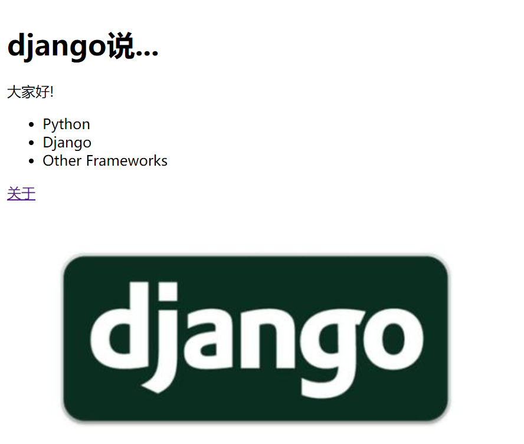

#  第八天

## 模型、视图、模板
我们已经定义了两个模型，还在数据库中填充了一些示例数据，接下来可以连接模型、视图和模板。

### 创建数据驱动页面的流程

在 Django 中创建数据驱动页面主要分为 5 步：
1. 在 views.py 文件中导入想使用的模型。
2. 在视图函数中查询模型，获取想呈现的数据。
3. 把从模型获取的数据传给模板上下文。
4. 创建或修改模板，显示上下文中的数据。
5. 把 URL 映射到视图上。
以上就是在 Django 框架中把模型、视图和模板连接在一起的步骤。

### 在首页上显示分类（Category）

#### 导入所需的模型

首先完成第一步。打开 navigation/views.py 文件，在顶部他导入语句之后从 Rango 应用的 models.py文件中导入 Category 模型：

`from navigation.models import Category`

#### 修改index视图

下面完成第 2 步和第 3 步。我们要修改主页的视图函数，即 index()。根据下述代码修改。

```
def index(request):
    # 查询数据库，获取目前存储的所有分类
    # 按点赞次数倒序排列分类
    # 获取前 5 个分类（如果分类数少于 5 个，那就获取全部）
    # 把分类列表放入 context_dict 字典
    # 稍后传给模板引擎
    category_list = Category.objects.order_by('-likes')[:5]
    context_dict = {'categories': category_list}
    # 渲染响应，发给客户端
    return render(request, 'navigation/index.html', context_dict)
```

这里的 Category.objects.order_by('-likes')[:5] 从 Category 模型中查询最受欢迎的前 5 个分类。 order_by() 方法的作用是排序，这里我们根据 likes 字段的值倒序排列。 -likes 中的 - 号表示倒序（如果没有 - 号，返回的结果是升序排列的）。因为我们想获得一个分类对象列表，所以使用 Python 的列表切片从列表中获取前 5 个对象（ [:5]），返回一个 Category 对象子集。查询结束后，把列表的引用（ category_list 变量）传给 context_dict 字典。最后把这个字典作为模板上下文传给 render() 函数。

#### 修改index.html模板
更新视图之后，接下来要做第 4 步，更新项目根目录中 templates 目录里的 navigation/index.html 模板。根据下述代码片段修改模板中的 HTML。

```
<!DOCTYPE html>

<html>
  <head>
    <title>navigation</title>
  </head>
  <body>
    <h1>django说...</h1>
    <div>大家好!</div>
    <div>
      
      <ul>
        
        <li>{{ category.name }}</li>
        
      </ul>
      
      <strong>没有分类.</strong>
      
    </div>
    <div>
      <a href="/navigation/about/">关于</a><br />
      
    </div>
  </body>
</html>
```

这里，我们使用 Django 模板语言提供的 if 和 for 控制语句呈现数据。在页面的 <body> 元素中，我们判断 categories（包含分类列表的上下文变量）中有没有分类``。如果有分类，构建一个 HTML 无序列表` <ul>` 。 for 循环迭代分类列表` `，在列表项目` <li> `标签中输出各分类的名称`{{ category.name }}`。
如果没有分类，显示一个消息，指明没有分类。从上述代码片段可以看出， Django 模板语言中的命令放在  之间，而变量放在 {{ 和 }} 之间。

现在访问 navigation 的主页应该会看到页面标题下方显示着分类列表



### 创建分类页面
每个分类还有对应的详情页面(显示这个catagory所关联的page)我们要定义一个参数化视图，而且 URL 模式中要编码分类名称。

#### URL 设计和映射

我们可以在 URL 中使用分类的唯一 ID，例如 /navigation/category/1/ 或 /navigation/category/2/，其中的数字 1 和 2 是分类的唯一 ID。可是从 ID 上看不出到底是哪个分类。

更好的方法是在 URL 中使用分类的名称。例如，可以通过 URL /navigation/category/python/ 访问与Python 相关的网页列表。这样的 URL 简单、可读性高，而且具有一定的语义。如果采用这种形
式，还要处理有多个单词的分类名，例如“Other Frameworks”。

为此，我们要使用 Django 提供的 slugify 函数。

#### 为分类添加 slug 字段
为了得到可读性高的 URL，我们要为 Category 模型添加一个别名（ slug）字段。然后使用 Django提供的 slugify 函数把空白替换为连字符，例如 "how do i create a slug in django" 将变成"how-do-i-create-a-slug-in-django"

此外，还要覆盖 Category 模型的 save() 方法，调用 slugify() 函数更新 slug 字段。注意，只要分类名称变了，别名就随之改变。参照下述代码片段更新模型

```
from django.template.defaultfilters import slugify
# Create your models here.
class Category(models.Model):
    name = models.CharField(max_length=128, unique=True)
    views = models.IntegerField(default=0)
    likes = models.IntegerField(default=0)
    slug = models.SlugField()

    def save(self, *args, **kwargs):
        self.slug = slugify(self.name)
        super(Category, self).save(*args, **kwargs)

    class Meta:
        verbose_name_plural = 'Categories'

    def __str__(self):
        return self.name
```
更新模型之后，接下来要把变动应用到数据库上。然而，数据库中已经有数据了，因此我们必须考虑改动产生的影响。其实我们想做的很简单，就是从分类名称中得到别名（此项操作在初次保存记录时执行）。通过迁移工具能把 slug 字段添加到数据库中，而且可以为该字段指定默认值。可是，每个分类的别名应该是不同的。因此，我们将先执行迁移，然后重新运行填充脚本。之所以这么做，是因为填充脚本会在分类上调用 save() 方法，从而触发上面实现的 save() 方法，


```
# 执行makemigrations
python manage.py makemigrations navigation
# 结果
You are trying to add a non-nullable field 'slug' to category without a default; we can't do that (the database needs something to populate existing rows).
Please select a fix:
 1) Provide a one-off default now (will be set on all existing rows with a null value for this column)
 2) Quit, and let me add a default in models.py
Select an option: 1
Please enter the default value now, as valid Python
The datetime and django.utils.timezone modules are available, so you can do e.g. timezone.now
Type 'exit' to exit this prompt
>>> ''
Migrations for 'navigation':
  navigation\migrations\0004_category_slug.py
    - Add field slug to category
# 运行 migrate
python manage.py migrate
Operations to perform:
  Apply all migrations: admin, auth, contenttypes, navigation, sessions
Running migrations:
  Applying navigation.0004_category_slug... OK
```

我们没有为 slug 字段指定默认值，而且数据库中有数据，因此 makemigrations 命令会给你两个选择。选提供默认值的1选项，输入一个空字符串（两个引号，即 ''）。
运行填充脚本，更新 slug字段。
```
python populate.py
开始导入数据
- Python - Official Python Tutorial
- Python - How to Think like a Computer Scientist
- Python - Learn Python in 10 Minutes
- Django - Official Django Tutorial
- Django - Django Rocks
- Django - How to Tango with Django
- Other Frameworks - Bottle
- Other Frameworks - Flask
```

执行 python manage.py runserver 命令，启动 Django 开发服务器，在管理界面中查看模型中的数据

#### 创建分类页面的步骤

为了实现可通过 /rango/category/<category-name-slug>/ 访问的分类页面，我们要做几处修改。基
本步骤如下：
1. 把 Page 模型导入 navigation/views.py 模块。
2. 在 navigation/views.py 模块中定义一个新视图，命名为 show_category()。这个视图有个额外的参数， category_name_slug，用于传入编码后的分类名称。为了编码和解码category_name_slug，要定义两个辅助函数。
3. 创建一个模板， templates/navigation/category.html。
4. 更新 navigation/urls.py. 中的 urlpatterns，把这个新视图映射到 URL 模式上。

此外还要更新 index() 视图和 index.html 模板，添加指向分类页面的链接。

#### 分类视图
在 navigation/views.py 中，首先导入 Page 模型，即把下述导入语句添加到文件顶部：
`from navigation.models import Page`

然后定义视图 show_category()。
```
def show_category(request, category_name_slug):
    # 创建上下文字典，稍后传给模板渲染引擎
    context_dict = {}
    try:
        # 能通过传入的分类别名找到对应的分类吗？
        # 如果找不到， .get() 方法抛出 DoesNotExist 异常
        # 因此 .get() 方法返回一个模型实例或抛出异常
        category = Category.objects.get(slug=category_name_slug)
        # 检索关联的所有网页
        # 注意， filter() 返回一个网页对象列表或空列表
        pages = Page.objects.filter(category=category)
        # 把得到的列表赋值给模板上下文中名为 pages 的键
        context_dict['pages'] = pages
        # 也把从数据库中获取的 category 对象添加到上下文字典中
        # 我们将在模板中通过这个变量确认分类是否存在
        context_dict['category'] = category
    except Category.DoesNotExist:
        # 没找到指定的分类时执行这里
        # 什么也不做
        # 模板会显示消息，指明分类不存在
        context_dict['category'] = None
        context_dict['pages'] = None
    # 渲染响应，返回给客户端
    return render(request, 'navigation/category.html', context_dict)
```

这个视图的基本步骤与 index() 视图一样。首先定义上下文字典，然后尝试从模型中提取数据，并把相关数据添加到上下文字典中。我们通过传给 show_category() 视图函数的category_name_slug 参数确认要查看的是哪个分类。如果通过别名找到了分类，获取与之关联的网页，并将其添加到上下文字典 context_dict 中。

#### 分类模板
下面为这个新视图创建模板。在templates/navigation/ 目录中新建 category.html 文件，写入下述代码。

```
<!DOCTYPE html>
<html>
  <head>
    <title>navigation</title>
  </head>
  <body>
    <div>
    
      <h1>{{ category.name }}</h1>
      
        <ul>
          
            <li><a href="{{ page.url }}">{{ page.title }}</a></li>
          
        </ul>
      
         <strong>当前分类没有内容.</strong>
      
    
      指定分类不存在
    
    </div>
  </body>
</html
```

上述 HTML 代码再次展示了如何通过 `{{ }}` 标签使用模板上下文中的数据。我们访问了 category和 pages 对象，以及它们的字段，例如 `category.name` 和 `page.url`。如果 category 存在，再检查分类下有没有网页。如果有，使用模板标签 ``迭代网页，显示 pages 列表中各网页的 title 和 url 属性。网页的信息在一个 HTML 无序列表（` <ul>` 标签）中显示。

#### 配置url(带参数的url)
下面看看 category_name_slug 参数的值是如何传给 show_category() 视图函数的。打开 navigation 应用的 urls.py 文件

```
urlpatterns = [
    path('', views.index, name='index'),
    path('about/', views.about, name='about'),
    path('category/<slug:category_name_slug>/', views.show_category, name='show_category'),
]
```
我们添加了一个 URL 

`path('category/<slug:category_name_slug>/', views.show_category, name='show_category')`

这里有两点要注意。首先， URL 模式中有个参数，即 `category_name_slug`，在视图中可以访
问。声明带参数的 URL 时，要确保对应的视图中有那个参数。其次，<slug:category_name_slug>匹配连续的数字字母（即 a-z、 A-Z 或 0-9，）和连字符（-）

新增的 URL 匹配 `navigation/category/` 和`末尾的 /` 之间的数字字母和连字符序列。匹配的序列存储在参数 category_name_slug 中，传给 views.show_category() 函数。例如，对 navigation/category/other-frameworks/ 这个 URL 来说， category_name_slug 参数的值是 other-frameworks。

Django 应用中的视图函数必须至少有一个参数。这个参数通常命名为 request，通过它获取与HTTP 请求有关的信息。如果 URL 中带有参数，必须为对应的视图函数声明额外的具名参数。鉴于此， show_category() 视图才定义为 def show_category(request, category_name_slug)。

[关于path详细用法](https://docs.djangoproject.com/en/2.2/topics/http/urls/)

#### 修改 index 模板

新视图可用了，但是还有一件事要做。我们要修改首页的模板，为列出的分类添加链接，指向分
类页面。更新 index.html 模板，加入指向分类页面的链接。

```
<!DOCTYPE html>

<html>
  <head>
    <title>Rango</title>
  </head>
  <body>
    <h1>django说...</h1>
    <div>大家好!</div>
    <div>
      
      <ul>
        
        <!-- 修改下面这一行，添加链接 -->
          <li>
          <a href="/navigation/category/{{ category.slug }}">{{ category.name }}</a>
          </li>
        
      </ul>
      
      <strong>没有分类.</strong>
      
    </div>
    <div>
      <a href="/navigation/about/">关于</a><br />
      
    </div>
  </body>
</html>
```

这里也是使用 HTML `<ul>` 标签定义一个无序列表，里面有一系列列表项目（ `<li>`），其中有一个HTML 超链接（ `<a>`）。超链接有个 href 属性，其值为 /navigation/category/{{ category.slug }}。例如， “Python”分类对应的 URL 是 /rango/category/python/。

访问首页检查下结果


点击python


### 练习
1. 更新填充脚本，为各网页添加访问次数（ views 字段）。
2. 修改首页，加上访问次数最多的 5 个网页。
3. 为两块信息添加标题，分别为“最受喜欢的分类”和“访问最多的页面”。
4. 在分类页面添加回到首页的链接。


### 答案
```
# populate.py
import os

os.environ.setdefault('DJANGO_SETTINGS_MODULE',
                      'first_project.settings')
import django
django.setup()

from navigation.models import Category, Page

def populate():
    python_pages = [
        {"title": "Official Python Tutorial",
         "views": 20,
         "url":"http://docs.python.org/2/tutorial/"},
        {"title":"How to Think like a Computer Scientist",
         "views": 12,
         "url":"http://www.greenteapress.com/thinkpython/"},
        {"title":"Learn Python in 10 Minutes",
         "views": 15,
         "url":"http://www.korokithakis.net/tutorials/python/"} ]

    django_pages = [
        {"title": "Official Django Tutorial",
         "views": 15,
         "url":"https://docs.djangoproject.com/en/1.9/intro/tutorial01/"},
        {"title": "Django Rocks",
         "views": 10,
         "url": "http://www.djangorocks.com/"},
        {"title": "How to Tango with Django",
         "views": 10,
         "url": "http://www.tangowithdjango.com/"}]
    other_pages = [
        {"title": "Bottle",
         "views": 10,
         "url":"http://bottlepy.org/docs/dev/"},
        {"title": "Flask",
         "views": 17,
         "url": "http://flask.pocoo.org"}]

    cats = {"Python": {"pages": python_pages},
            "Django": {"pages": django_pages},
            "Other Frameworks": {"pages": other_pages} }

    for cat, cat_data in cats.items():
        c = add_cat(cat)
        for p in cat_data["pages"]:
            # 修改
            add_page(c, p["title"], p["url"],p["views"])

    for c in Category.objects.all():
        for p in Page.objects.filter(category=c):
            print("- {0} - {1}".format(str(c),str(p)))


def add_page(cat, title, url, views=0):
    p = Page.objects.get_or_create(category=cat, title=title)[0]
    p.url = url
    p.views = views
    p.save()
    return p

def add_cat(name):
    if name == 'Python':
        c = Category.objects.get_or_create(name=name,views=128,likes=64)[0]
    elif name == "Django":
        c = Category.objects.get_or_create(name=name, views=64, likes=32)[0]
    elif name == "Other Frameworks":
        c = Category.objects.get_or_create(name=name, views=32, likes=16)[0]
    c.save()
    return c

if __name__ == '__main__':
    print("开始导入数据")
    populate()

# views.py index视图
def index(request):
    # 查询数据库，获取目前存储的所有分类
    # 按点赞次数倒序排列分类
    # 获取前 5 个分类（如果分类数少于 5 个，那就获取全部）
    # 把分类列表放入 context_dict 字典
    # 稍后传给模板引擎
    category_list = Category.objects.order_by('-likes')[:5]
    context_dict = {'categories': category_list}
    # 查询数据库，获取目前存储的所有页面
    # 按点赞次数倒序排列分类
    # 获取前 5 个页面（如果分类数少于 5 个，那就获取全部）
    # 把分类列表放入 context_dict 字典
    # 稍后传给模板引擎
    page_list = Page.objects.order_by('-views')[:5]
    context_dict["pages"] = page_list
    # 渲染响应，发给客户端
    return render(request, 'navigation/index.html', context_dict)

# index 模板
<!DOCTYPE html>

<html>
  <head>
    <title>Rango</title>
  </head>
  <body>
    <h1>django说...</h1>
    <div>最受喜欢的分类</div>
    <div>
      
      <ul>
        
          <li>
          <a href="/navigation/category/{{ category.slug }}">{{ category.name }}</a>
          </li>
        
      </ul>
      
      <strong>没有分类.</strong>
      
    </div>
    <div>访问最多的网页</div>
    <div>
      
      <ul>
        
          <li>
          <a href="{{ page.url}}">{{page.title}}</a>
          </li>
        
      </ul>
      
      <strong>没有页面.</strong>
      
    </div>
    <div>
      <a href="/navigation/about/">关于</a><br />
      
    </div>
  </body>
</html>
# category 模板
<!DOCTYPE html>
<html>
  <head>
    <title>navigation</title>
  </head>
  <body>
    <div>
    
      <h1>{{ category.name }}</h1>
      
        <ul>
          
            <li><a href="{{ page.url }}">{{ page.title }}</a></li>
          
        </ul>
      
         <strong>当前分类没有内容.</strong>
      
    
      指定分类不存在
    
    </div>
    # 新增首页链接
    <div>
      <a href="/navigation/">首页</a><br />
    </div>
  </body>
</html
```
##  模板进阶

目前，我们为 navigation 应用的几个页面创建了 HTML 模板。你可能发现了，不同模板之间有很多HTML 代码是重复的，这违背了 DRY 原则。此外，你可能也注意到了，链接中使用的是硬编码的 URL 路径。这些问题会导致网站难以维护，倘若想改变网站的整体结构，或者调整 URL 路径，每个模板都要修改。

### 相对url
目前，模板中的链接地址使用的是硬编码的 URL，例如 <a href="/navigation/about/">关于</a>。这样做的缺点是一Ȁ修改了 urls.py 中的 URL 映射，就要更新对应的所有 URL 引用。正确的方法是使用模板标签 ``查询 urls.py 文件中的 URL 模式，动态插入 URL 路径。

在模板中使用相对 URL 十分简单。若想链接到关于页面，可以在模板中插入下面这行代码：
`<a href="">关于</a>`

navigation 应用的 index.html 模板中有个带参数的 URL，即 /navigation/category/{{ category.slug }}。为了避免硬编码，我们可以使用 url 模板标签，并指定 URL（或视图）的名称和分类的别名，如下所示
```
        
          <li>
          <a href="">{{ category.name }}</a>
          </li>
        
```

### 去重重复

几乎每个专业的网站都有一系列重复的组件，例如页头、侧边栏和页脚，但是每个页面都重复编写这些组件的 HTML 显然是不明智的。试想，如果要调整网站的页头呢？你要修改每个页面，换用新的页头。这是个费时的工作，而且可能出现人为错误。为免浪费时间复制粘贴 HTML 标记，我们可以利用 Django 模板引擎提供的模板继承功能尽量避免重复。使用模板继承的基本步骤如下：

1. 找出模板中重复出现的部分，例如页头、侧边栏、页脚和内容区。有时，你可以把各页面的结构画在纸上，这样便于找出通用的部分。
2. 创建一个基模板（ base template），实现页面的基本骨架结构，提供通用的部分（例如页头的徽标和标题，页脚的版权声明），并定义一些区块（ block），以便在不同的页面调整所显示的内容。
3. 为应用的不同页面创建专门的模板，都继承自基模板，然后指定各区块的内容


#### 定义base模板

显然，目前我们创建的模板有很多重复的 HTML 代码。下面把各页面显示的具体内容剔除，得到
各模板重复使用的骨架结构。

```
<!DOCTYPE html>

<html>
  <head lang="en">
    <meta charset="UTF-8" />
    <title>Navigation</title>
  </head>
  <body>
    <!-- 各页面的具体内容 -->
  </body>
</html>
```

我们暂且把这个 HTML 页面作为 navigtion 应用的基模板。把上述代码保存在 templates/navigation/ 目录中的 base.html 文件里。

#### 定义区块
创建好基础模板之后，接下来要指明模板中的哪些部分可由继承它的模板覆盖。为此，要使用
block 标签。例如，可以像下面这样在 base.html 模板中添加 body_block 区块

```
<!DOCTYPE html>

<html>
  <head lang="en">
    <meta charset="UTF-8" />
    <title>Navigation</title>
  </head>
  <body>
    
    
  </body>
</html>
```

Django 模板标签放在  之间。因此，区块以  开头，其中<NAME> 是区块的名称。区块必须以 endblock 结尾，而且也要放在  之间，即 。

可以为区块指定默认内容，在子模板没有提供该区块的内容时使用。指定默认内容的方法是在  和  之间添加 HTML 标记，如下所示。
```
    
      这是区块默认内容
    
```

创建各页面的模板时，我们将继承 navigation/base.html 模板，然后覆盖 body_block 区块的内容。模板中的区块数量不限，可以根据需要定义。例如，可以创建页面标题区块、页脚区块、侧边栏区块，等等。区块是 Django 模板系统一个特别强大的功能。

#### 模板继承

创建好基模板之后，接下来要更新其他模板，让它们继承基模板。先重构 navigation/index.html 模板。

```



    <h1>django说...</h1>
    <div>最受喜欢的分类</div>
    <div>
      
      <ul>
        
          <li>
          <a href="">{{ category.name }}</a>
          </li>
        
      </ul>
      
      <strong>没有分类.</strong>
      
    </div>
    <div>访问最多的网页</div>
    <div>
      
      <ul>
        
          <li>
          <a href="{{ page.url}}">{{page.title}}</a>
          </li>
        
      </ul>
      
      <strong>没有页面.</strong>
      
    </div>
    <div>
      <a href="">关于</a><br />
      
    </div>

```

### 练习
1. 重构catagroy模板
2. 重构about模板

### 答案
```
# catagroy.html



    <div>
    
      <h1>{{ category.name }}</h1>
      
        <ul>
          
            <li><a href="{{ page.url }}">{{ page.title }}</a></li>
          
        </ul>
      
         <strong>当前分类没有内容.</strong>
      
    
      指定分类不存在
    
    </div>
    <div>
      <a href="">首页</a><br />
    </div>


# about.html

 

    <h1>我们在一起了</h1>
    
    <div>
      <a href="/navigation/">首页</a><br />
       
       
    </div>

```

## 用户身份验证
接下来介绍 Django 提供的用户身份验证机制。我们将使用 django.contrib.auth 包中的 auth 应用。

这个应用提供了下述概念和功能：
1. 用户和用户模型
2. 权限，判断用户可以做什么及不可以做什么的旗标（是/否）
3. 用户组，把相关权限一次赋予多个用户
4. 可配置的密码哈希系统，保证数据安全不可或缺
5. 登录或限制性内容所需的表单和视图

### 设置身份验证

在使用 Django 提供的身份验证机制之前，要在项目的 settings.py 文件中添加相关的设置。
在 settings.py 文件中找到 INSTALLED_APPS 列表，检查有没有列出 django.contrib.auth 和
django.contrib.contenttypes。 INSTALLED_APPS 列表应该类似下面这样：

```
INSTALLED_APPS = [
    'django.contrib.admin',
    'django.contrib.auth',
    'django.contrib.contenttypes',
    'django.contrib.sessions',
    'django.contrib.messages',
    'django.contrib.staticfiles',
    'navigation',
]
```

django.contrib.auth 用于访问 Django 提供的身份验证系统，django.contrib.contenttypes 供auth 应用跟踪数据库中的模型。

### User 模型

User 对象（ django.contrib.auth.models.User）是 Django 身份验证系统的核心，表示与 Django应用交互的每个个体。根据 Django 文档，身份验证系统的很多方面都能用到 User 对象，例如访问限制、注册新用户，以及网站内容与创建者之间的关系。

User 模型有 5 个主要属性：
1. 用户账户的用户名（ username）
2. 用户账户的密码（ password）
3. 用户的电子邮件地址（ email）
4. 用户的名字（ first_name）
5. 用户的姓（ last_name）

此外， User 模型还有其他属性，例如 is_active、 is_staff 和 is_superuser。这些属性的值都是布尔值，分别用于指明账户是否激活、是否为团队成员，以及是否拥有超级用户权限。

### 增加用户属性
除了 User 模型提供的属性之外，如果还需要其他用户相关的属性，要自己定义一个与 User 模型关联的模型。对 navigation 应用而言，我们想为用户账户增加两个属性：
1. 一个 URLField，让 navigation 的用户设定自己的网站
2. 一个 ImageField，让 navigation 的用户设定自己的头像

为此，要在 navigation 应用的 models.py 文件中定义一个模型。我们把这个模型命名为 UserProfile。
```
class UserProfile(models.Model):
    # 这一行是必须的
    # 建立与 User 模型之间的一对一关系
    user = models.OneToOneField(User,on_delete=models.CASCADE)
    # 想增加的属性
    website = models.URLField(blank=True)
    picture = models.ImageField(upload_to='profile_images', blank=True)
    
    def __str__(self):
        return self.user.username
```

注意，这个模型与 User 模型之间建立的一对一关系。因为引用了默认的 User 模型，所以要在
models.py 文件中导入它：

`from django.contrib.auth.models import User`

我们增加的 website 和 picture 字段都设定了 blank=True。因此这两个字段都可以为空，不是必须要提供值。此外，注意 ImageField 字段的 upload_to 参数。这个参数的值与项目的 MEDIA_ROOT 设置结合在一起，确定上传的头像存储在哪里。假如 MEDIA_ROOT 的值为first_project/media/， upload_to 参数的值为 profile_images，那么头像将存储在 first_project/media/profile_images/ 目录中。

执行命令:
```
python manage.py makemigrations navigation
python manage.py migrate
```

Django 的 ImageField 字段要使用 Python Imaging Library（ PIL）。如果你还未安装，执行
pip install pillow 命令，通过 pip 安装 PIL。
`pip3 install pillow`

###  创建用户注册视图和模板
实现用户注册功能的步骤如下：
1. 定义 UserForm 和 UserProfileForm
2. 添加一个视图，处理创建新用户的过程
3. 创建一个模板，显示 UserForm 和 UserProfileForm
4. 把 URL 映射到前面添加的视图上
5. 最后，还要在首页添加一个链接，指向注册页面

#### 定义 UserForm 和 UserProfileForm
我们要在 navigation/forms.py 中定义两个类，继承自 forms.ModelForm。其中一个针对 User 类，另一个针对前面定义的 UserProfile 模型。这两个 ModelForm 子类创建的 HTML 表单用于显示相应模型的字段，为我们节省了很多工作量

```
class UserForm(forms.ModelForm):
    password = forms.CharField(widget=forms.PasswordInput())
    class Meta:
        model = User
        fields = ('username', 'email', 'password')

class UserProfileForm(forms.ModelForm):
    class Meta:
        model = UserProfile
        fields = ('website', 'picture')
```
注意，这两个类中都有 Meta 类。如其名所示， Meta 类的作用是为所在的类提供额外的属性。 Meta
类中必须有 model 字段。 UserForm 类对应的模型是 User。此外，还要通过 fields 或 exclude 指定要在表单中显示或排除的字段

这里，我们只想显示 User 模型的 username、 email 和 password 字段，以及 UserProfile 模型的website 和 picture 字段。 UserProfile 模型的 user 字段在注册用户时设定。这是因为创建UserProfile 实例时，还没有 User 实例可用。此外，注意 UserForm 中定义了 password 属性。虽然 User 模型实例有 password 属性，但是在渲染的 HTML 表单中这个字段的值不会被遮盖，用户输入的密码是可见的。鉴于此，我们重新定义了assword 属性，指定使用 PasswordInput() 小组件显示这个 CharField，以防用户输入的密码被人窥见。最后，别忘了在 forms.py 模块的顶部导入所需的类。为了便于你参考，下面给出导入语句：
```
from django import forms
from django.contrib.auth.models import User
from navigation.models import UserProfile 
```


### 定义 register() 视图

接下来要渲染表单及处理表单数据。在 Rango 应用的 views.py 模块中，添加一个 import 语句，导入新定义的 UserForm 和 UserProfileForm 类。
`from navigation.forms import UserForm, UserProfileForm`
然后定义 register() 视图：
```
def register(request):
    # 一个布尔值，告诉模板注册是否成功
    # 一开始设为 False，注册成功后改为 True
    registered = False
    # 如果是 HTTP POST 请求，处理表单数据
    if request.method == 'POST':
        # 尝试获取原始表单数据
        # 注意， UserForm 和 UserProfileForm 中的数据都需要
        user_form = UserForm(data=request.POST)
        profile_form = UserProfileForm(data=request.POST)
        # 如果两个表单中的数据是有效的……
        if user_form.is_valid() and profile_form.is_valid():
            # 把 UserForm 中的数据存入数据库
            user = user_form.save()
            # 使用 set_password 方法计算密码哈希值
            # 然后更新 user 对象
            user.set_password(user.password)
            user.save()
            # 现在处理 UserProfile 实例
            # 因为要自行处理 user 属性，所以设定 commit=False
            # 延迟保存模型，以防出现完整性问题
            profile = profile_form.save(commit=False)
            profile.user = user
            # 用户提供头像了吗？
            # 如果提供了，从表单数据库中提取出来，赋给 UserProfile 模型
            if 'picture' in request.FILES:
                profile.picture = request.FILES['picture']
                # 保存 UserProfile 模型实例
            profile.save()
            # 更新变量的值，告诉模板成功注册了
            registered = True
        else:
            # 表单数据无效，出错了
            # 在终端打印问题
            print(user_form.errors, profile_form.errors)
    else:
        # 不是 HTTP POST 请求，渲染两个 ModelForm 实例
        # 表单为空，待用户填写
        user_form = UserForm()
        profile_form = UserProfileForm()
    # 根据上下文渲染模板
    return render(request,
                  'navigation/register.html',
                  {'user_form': user_form,
                  'profile_form': profile_form,
                  'registered': registered})
```

### 创建注册页面的模板
现在要创建 register() 视图的模板。新建 navigation/register.html 文件，写入下述代码

```



  <h1>注册</h1>
  
  <strong>感谢注册</strong>
  <a href="">返回首页</a><br />
  
  <strong>在此注册！</strong><br />
  <form id="user_form" method="post" action=""
       enctype="multipart/form-data">

    

    <!-- 显示每个表单 -->
    <!--
    {{ user_form.as_p }}
    {{ profile_form.as_p }}-->
    <p><label for="id_username">用户名:</label> {{ user_form.username }}</p>
    <p><label for="id_email">邮箱地址:</label> {{ user_form.email }} </p>
    <p><label for="id_password">密码:</label> {{ user_form.password}} </p>
    <p><label for="id_website">个人网站:</label> {{ profile_form.website }} </p>
    <p><label for="id_picture">头像:</label> {{profile_form.picture}} </p>

    <!-- 提供一个按钮，点击后提交表单 -->
     <input type="submit" name="submit" value="Register" />
    </form>
  

```

注意，这个模板使用视图中的 registered 变量判断注册是否成功。 registered 的值为 False 时，显示注册表单；否则，显示成功注册消息。此外，我们在 user_form 和 profile_form 上调用了 as_p 模板函数。这么做的目的是在段落（ HTML `<p>` 标签）中显示各个表单元素，一行显示一个表单元素。最后注意，我们为` <form>` 元素设定了 enctype 属性。这是因为，如果用户想上传头像，表单数据中将包含二进制数据，而且可能相当大。传给服务器时，这些数据要分成几部分。因此，我们要设定 enctype="multipart/form-data"，让 HTTP 客户端（ Web 浏览器）分段打包和发送数据。如若不然，服务器收不到用户提交的全部数据。

在表单中添加 CSRF 令牌，即 ``。否则， Django 的跨站请求伪造保
护中间件将拒绝接收表单的内容，返回错误

### 添加 URL 映射
有了视图和对应的模板之后，现在可以添加 URL 映射了。打开 navigation 应用的 urls.py 模块，根据下述代码修改

```
urlpatterns = [
    path('', views.index, name='index'),
    path('about/', views.about, name='about'),
    path('category/<slug:category_name_slug>/', views.show_category, name='show_category'),
    path('register/',views.register,name='register'), 
]
```

新增的模式把 /navigation/register/ URL 映射到 register() 视图上。注意，我们为这个新模式设定了
name 参数，以便在模板中使用 url 引用，例如 

### 添加链接
最后，在 base.html 模板中添加一个链接，指向注册页面。参照下述代码更新无序列表中的链接，
在 navigation 应用的每个页面中都添加指向注册页面的链接。

```
<!DOCTYPE html>

<html>
  <head lang="en">
    <meta charset="UTF-8" />
    <title>Navigation</title>
  </head>
  <body>
    
      这是区块默认内容
    
    <ul>
      <li><a href="">关于</a></li>
      <li><a href="">首页</a></li>
      <li><a href="">注册</a></li>
    </ul>
  </body>
</html>
```

### 实现登录功能

用户能注册账户之后，接下来要让用户能够登录。为此，要执行以下几步：
1. 定义一个视图，处理登录凭据
2. 创建一个模板，显示登录表单
3. 把登录视图映射到一个 URL 上
4. 在首页添加登录链接

#### 定义登录视图

首先，打开 navigation 应用的 views.py 模块，定义一个新视图，名为 user_login()。这个视图负责处
理登录表单提交的数据，以及登入用户。

```
def user_login(request):
    # 如果是 HTTP POST 请求，尝试提取相关信息
    if request.method == 'POST':
        # 获取用户在登录表单中输入的用户名和密码
        # 我们使用的是 request.POST.get('<variable>')
        # 而不是 request.POST['<variable>']
        # 这是因为对应的值不存在时，前者返回 None，
        # 而后者抛出 KeyError 异常
        username = request.POST.get('username')
        password = request.POST.get('password')
        # 使用 Django 提供的函数检查 username/password 是否有效
        # 如果有效，返回一个 User 对象
        user = authenticate(username=username, password=password)
        # 如果得到了 User 对象，说明用户输入的凭据是对的
        # 如果是 None（ Python 表示没有值的方式），说明没找到与凭据匹配的用户
        if user:
        # 账户激活了吗？可能被禁了
            if user.is_active:
                # 登入有效且已激活的账户
                # 然后重定向到首页
                login(request, user)
                return redirect(reverse('index'))
            else:
                # 账户未激活，禁止登录
                return HttpResponse("Your Rango account is disabled.")
        else:
            # 提供的登录凭据有问题，不能登录
            print("Invalid login details: {0}, {1}".format(username, password))
            return HttpResponse("Invalid login details supplied.")
    # 不是 HTTP POST 请求，显示登录表单
    # 极有可能是 HTTP GET 请求
    else:
        # 没什么上下文变量要传给模板系统
        # 因此传入一个空字典
        return render(request, 'navigation/login.html', {})
```

跟之前一样，因为要处理不同的情况，这个视图看起来十分复杂。从上述代码可以看出，user_login() 视图既能渲染登录表单（包含 username 和 password 两个字段），也能处理表单数据。

如果通过 HTTP GET 方法访问这个视图，显示登录表单。然而，如果通过 HTTP POST 请求访问，则处理表单数据。如果通过 POST 请求发送有效的表单数据，从中提取用户名和密码。

然后使用 Django 提供authenticate() 函数检查用户名和密码是否匹配某个用户账户。如果能找到这样的用户，返回一个 User 对象，否则返回 None。返回 User 对象时，检查账户是否激活。如果是激活的，调用 Django 提供的 login() 函数，登入用户。然而，如果发送的表达数据无效，例如用户名和密码没有都填，登录表单显示错误消息，提示用户名或密码无效。

redirect函数，从名称可以看出，redirect 函数生成的响应让 Web 浏览器重定向到参数指定的 URL。注意，响应的HTTP 状态码是表示重定向的 302，而不是表示成功的 200
login 函数，把用户的状态修改为登录。authenticate 函数判断用户的账号密码是否正确，正确返回用户对象，错误返回None
reverse函数 使用urls.py 中的name 生成相应的url

这里的几个函数需要导入
```
from django.shortcuts import redirect, reverse
from django.contrib.auth import authenticate, login
```

#### 创建登录模板
有了视图之后，我们还要创建一个模板，让用户输入登录凭据。现在你应该知道要把模板放在
templates/navigation/目录中,根据user_login视图函数，你来确定下模板的名称

```



<h1>Login to navigation</h1>
<form id="login_form" method="post" action="">
    
    用户名: <input type="text" name="username" value="" size="50" />
    <br />
    密码: <input type="password" name="password" value="" size="50" />
    <br />
    <input type="submit" value="登录" />
</form>

```

input 元素的 name 属性要与 user_login() 视图中的保持一致。也就是说，用户名输入框的 name属性的值应该是 username，而密码输入框的 name 属性的值应该是 password。此外，别忘了 。

#### 添加url

创建好登录模板之后，接下来要把 user_login() 视图映射到一个 URL 上。修改 navigation 应用的urls.py 模块，在 urlpatterns 列表中添加下述映射：

`path('login/', views.user_login, name='login'),`

#### 添加链接

最后，添加一个链接，方便 Rango 的用户访问登录页面。编辑 templates/navigation/ 目录中的 base.html,在无序列表中添加下述链接：
`<li><a href="">登录</a></li>`

还可以修改首页的页头，向已登录的用户显示独特的欢迎消息，而未登录的用户则显
示一般的欢迎消息。在 index.html 模板中修改为：
```
<h1>django说...
    
       {{ user.username }}!
    
      游客!
    </h1>
```

可以看出，我们使用  检查用户是否通过身份验证。如果用户已登录，我们能访问 user 对象。因此，我们可以通过这个对象判断用户是否登录（验证身份）。如果用户已登录，我们便能获取关于用户的更多信息。在这个示例中，当用户登录后，我们获取用户的用户名。如果用户未登录，则显示一般的欢迎消息

至此，用户登录功能可用了。请启动 Django 开发服务器，注册一个新账户试试。成功注册后，你
应该能使用自己设定的凭据登录。

#### 限制访问

使用装饰器限制未登录用户访问分类详情页面在show_category 视图函数上添加装饰器login_required
```
@login_required
def show_category(request, category_name_slug):
```
需要导入装饰器
`from django.contrib.auth.decorators import login_required`


#### 设置跳转登录页面
使用login_required装饰器时，如果未登录，默认会被重定向到/accounts/login/，这样会导致404
在settings.py中添加一行

`LOGIN_URL='/navigation/login/'`

LOGIN_URL 指定自己的登录url

### 退出

用户能注册和登录之后，还要能退出。 Django 提供的 logout() 函数能确保用户正确且安全地退出。用户的会话结束后，如果再想访问受限制的视图，要重新登录。为了提供退出功能，打开 rango/views.py 文件，添加名为 user_logout() 的视图，代码如下：

```
# 使用 login_required() 装饰器限制
# 只有已登录的用户才能访问这个视图
@login_required
def user_logout(request):
    # 可以确定用户已登录，因此直接退出
    logout(request)
    # 把用户带回首页
    return redirect(reverse('index'))
```

需要在 views.py 模块的顶部导入 logout() 函数：
`from django.contrib.auth import logout`

接下来，修改 navigation 应用的 urls.py 模块，把 URL /navigation/logout/ 映射到 user_logout() 视图

`path('logout/', views.user_logout, name='logout'),`

在base.html模板调整链接

```
<ul>
      <li><a href="">关于</a></li>
      <li><a href="">首页</a></li>
      
      
      
          <li><a href="">退出</a></li>
      
        <li><a href="">注册</a></li>
        <li><a href="">登录</a></li>
      
    </ul>
```

## cookie和会话

Web 浏览器（客户端）与服务器之间的通信都借由 HTTP 协议。前面说过， HTTP 是无状态的协议。因此， Web 浏览器所在的客户端电脑每次请求服务器中的资源（ HTTP GET）或者把资源发给服务器（ HTTP POST）都要建立新的网络连接（ TCP 连接）。

由于客户端和服务器之间无法建立持久连接，所以两端的软件都不能只依靠连接维持会话状态。例如，客户端发送的每个请求都要指明哪个用户在当前电脑上已登录 Web 应用。这是客户端与服务器之间的一种对话，是半永久性信息交互机制（即会话）的基础。

维持状态最常用的一种方式是在客户端电脑的 cookie 中存储会话 ID。你可以把会话 ID 理解为一种令牌（一串字符，或一个字符串），我们通过它唯一标识 Web 应用中的会话。这种方式无需在客户端的 cookie 中存储大量信息（例如用户名、姓名或密码），存储的只是会话 ID。通过这个ID 可以从 Web 服务器中获取包含所需信息的数据结构。通过这种方式存储用户的信息更安全，不会由于客户端的漏洞或者连接被监听而导致信息泄露。

### 在 Django 中设置session

请打开 Django 项目的 settings.py 文件，找到 MIDDLEWARE 列表。这个列表中应该有个元素是 django.contrib.sessions.middleware.SessionMiddleware。如果没有，请自己动手加上。 sessionid cookie 就是由 SessionMiddleware 中间件创建的。SessionMiddleware 中间件支持多种存储会话信息的方式，可以存在文件中、数据库中，甚至是内存中。最简单的方法是使用 django.contrib.sessions 应用，把会话信息存储在模型/数据库中（模型为 django.contrib.sessions.models.Session）。若想使用这种方法， Django 项目的INSTALLED_APPS 设置中还要列出 django.contrib.sessions。别忘了，添加这个应用后还要使用迁移命令更新数据库

### 客户端 cookie：访问次数统计示例

知道 cookie 的工作原理之后，下面来实现一个非常简单的网站访问次数统计功能。为此，我们要创建两个 cookie：一个记录用户访问 navigation 应用的次数，另一个记录用户最后一次访问网站的时间。之所以记录最后访问时间，是因为我们只想1s增加一次访问次数，以防有人恶意刷次数

假设有用户访问 navigation 应用的合理位置是首页。我们要定义一个函数，传入 request 和 response
对象，让它处理 cookie。然后在 navigation 应用的 index() 视图中调用。打开 navigation 应用的 views.py
文件，添加下述函数。注意，严格来说这不是视图函数，而是个辅助函数，因为它不返回
response 对象

```
def visitor_cookie_handler(request, response):
    # 获取网站的访问次数
    # 使用 COOKIES.get() 函数读取“visits”cookie
    # 如果目标 cookie 存在，把值转换为整数
    # 如果目标 cookie 不存在，返回默认值 1
    visits = int(request.COOKIES.get('visits', '1'))
    last_visit_cookie = request.COOKIES.get('last_visit', str(datetime.now()))
    last_visit_time = datetime.strptime(last_visit_cookie[:-7],'%Y-%m-%d %H:%M:%S')
    # 如果距上次访问已超过1s……
    if (datetime.now() - last_visit_time).seconds > 0:
        visits = visits + 1
        # 增加访问次数后更新“last_visit”cookie
        response.set_cookie('last_visit', str(datetime.now()))
    else:
        # 设定“last_visit”cookie
        response.set_cookie('last_visit', last_visit_cookie)
        # 更新或设定“visits”cookie
    response.set_cookie('visits', visits)
```

这个辅助函数的参数有两个，分别为 request 和 response 对象，因为我们既需要从入站请求中读取 cookie，也需要把 cookie 添加到响应中。在这个函数中，我们调用了 request.COOKIES.get()函数，这也是一个辅助函数，由 Django 提供。如果指定的 cookie 存在， COOKIES.get() 函数返回cookie 的值；如果不存在，我们可以提供一个默认值。

得到两个 cookie 的值之后，计算两次访问的间隔有没有超过1s。只要相差一秒就能更新访问次数。

注意，所有 cookie 的值都是字符串。不要以为存储整数的 cookie 会返回整数类型的值。你要自行转换为正确的类型，因为 cookie 并不知道它存储的值是什么类型。

如果 cookie 不存在，可以在 response 对象上调用 set_cookie() 方法，创建一个 cookie。这个方法接受两个参数，一个是想创建的 cookie 名称（字符串形式），另一个是 cookie 的值。传入的cookie 值不限类型， set_cookie() 方法会自动将其转换为字符串。这个函数用到了 datetime 模块，因此要在 views.py 文件的顶部将其导入。

`from datetime import datetime`

然后更新 index() 视图，调用 visitor_cookie_handler() 辅助函数。为此，要先提取得到
response 对象。

```
def index(request):
    # 查询数据库，获取目前存储的所有分类
    # 按点赞次数倒序排列分类
    # 获取前 5 个分类（如果分类数少于 5 个，那就获取全部）
    # 把分类列表放入 context_dict 字典
    # 稍后传给模板引擎
    category_list = Category.objects.order_by('-likes')[:5]
    context_dict = {'categories': category_list}
    # 渲染响应，发给客户端
    page_list = Page.objects.order_by('-views')[:5]
    context_dict["pages"] = page_list
    response = render(request, 'navigation/index.html', context_dict)
    # 调用处理 cookie 的辅助函数
    visitor_cookie_handler(request, response)
    # 返回 response 对象，更新目标 cookie
    return response
```