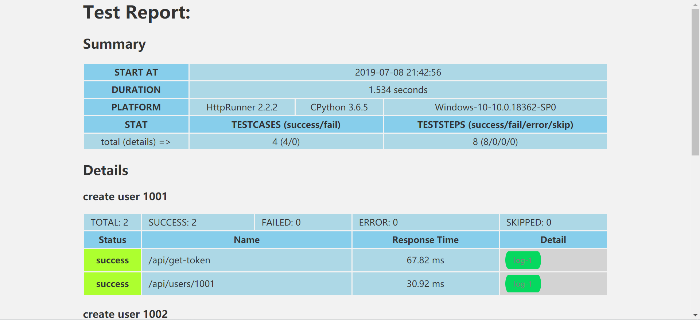

# 第十天

## 模块管理功能
模块的增删改查

### 创建模块的相关model 类

```
class Module(BaseTable):
    class Meta:
        verbose_name = '模块信息'
        db_table = 'ModuleInfo'

    module_name = models.CharField('模块名称', max_length=50, null=False)
    belong_project = models.ForeignKey(Project, on_delete=models.CASCADE)
    test_user = models.CharField('测试负责人', max_length=50, null=False)
    simple_desc = models.CharField('简要描述', max_length=100, null=True)
    other_desc = models.CharField('其他信息', max_length=100, null=True)
```
执行数据迁移命令
```
python  manage.py makemigrations
python  manage.py migrate
```

### 定义视图
先定义空视图
```
def module_add(request):
    pass

def module_list(request):
    pass

def module_edit(request):
    pass

def module_delete(request):
    pass

```

### 定义url
```
    path('module/list', views.project_list, name='module_list'),
    path('module/add', views.project_add, name='module_add'),
    path('module/edit', views.project_edit, name='module_edit'),
    path('module/delete', views.project_delete, name='module_delete'),
```
### 修改module_add视图

```
@csrf_exempt
def module_add(request):
    if request.method == 'GET':
        projects = Project.objects.all().order_by("-update_time")
        context_dict = {'data': projects}
        return render(request, 'module_add.html',context_dict)
    if request.is_ajax():
        module = json.loads(request.body.decode('utf-8'))
        if module.get('module_name') == '':
            msg = '模块名称不能为空'
            return HttpResponse(msg)
        if module.get('belong_project') == '请选择':
            msg = '请选择项目，没有请先添加哦'
            return HttpResponse(msg)
        if module.get('test_user') == '':
            msg = '测试人员不能为空'
            return HttpResponse(msg)
        p = Project.objects.get(project_name=module.get('belong_project'))
        if Module.objects.filter(module_name=module.get('module_name'), belong_project=p):
            msg = "项目已经存在"
            return HttpResponse(msg)
        else:
            m = Module()
            m.module_name = module.get('module_name')
            p = Project.objects.get(project_name=module.get('belong_project'))
            m.belong_project = p
            m.test_user = module.get('test_user')
            m.simple_desc = module.get('simple_desc')
            m.other_desc = module.get('other_desc')
            m.save()
            msg = 'ok'
        if msg == 'ok':
            return HttpResponse(reverse('module_list'))
        else:
            return HttpResponse(msg)
```

### 添加module_add.html模板
```

新增模块



    <div class=" admin-content">

        <div class="admin-biaogelist">
            <div class="listbiaoti am-cf">
                <ul class="am-icon-flag on"> 新增模块</ul>
                <dl class="am-icon-home" style="float: right;"> 当前位置： 模块管理 > <a href="#">新增模块</a></dl>
            </div>
            <div class="fbneirong">
                <form class="form-horizontal" id="add_module">
                    <div class="form-group  has-feedback">
                        <label class="control-label col-md-2 text-primary" for="module_name">模块名称：</label>
                        <div class="col-md-5">
                            <input type="text" class="form-control" id="module_name"
                                   aria-describedby="inputSuccess3Status" name="module_name" placeholder="请输入模块名称"
                                   value="">
                            <span class="glyphicon glyphicon-th-list form-control-feedback" aria-hidden="true"></span>
                        </div>
                    </div>
                    <div class="form-group">
                        <label class="control-label col-md-2 text-primary" for="belong_project">所属项目：</label>
                        <div class="col-md-5">
                            <select name="belong_project" class="form-control">
                                <option value="请选择">请选择</option>
                                
                                    <option value="{{ foo.project_name }}">{{ foo.project_name }}</option>
                                
                            </select>
                        </div>
                    </div>

                    <div class="form-group  has-feedback">
                        <label class="control-label col-md-2 text-primary" for="test_user">测试人员：</label>
                        <div class="col-md-5">
                            <input type="text" class="form-control" id="test_user" name="test_user"
                                   aria-describedby="inputSuccess3Status" placeholder="请输入参与的测试人员" value="">
                            <span class="glyphicon glyphicon-user form-control-feedback" aria-hidden="true"></span>
                        </div>
                    </div>

                    <div class="form-group  has-feedback">
                        <label class="control-label col-md-2 text-primary" for="simple_desc">简要描述：</label>
                        <div class="col-md-5">
                            <textarea type="text" rows="3" class="form-control" id="simple_desc" name="simple_desc"
                                      aria-describedby="inputSuccess3Status" placeholder="模块简单概述"></textarea>
                            <span class="glyphicon glyphicon-paperclip form-control-feedback" aria-hidden="true"></span>
                        </div>
                    </div>

                    <div class="form-group  has-feedback">
                        <label class="control-label col-md-2 text-primary" for="other_desc">其他信息：</label>
                        <div class="col-md-5">
                            <textarea type="text" rows="3" class="form-control" id="other_desc" name="other_desc"
                                      aria-describedby="inputSuccess3Status" placeholder="模块其他相关信息描述"></textarea>
                            <span class="glyphicon glyphicon-paperclip form-control-feedback" aria-hidden="true"></span>
                        </div>
                    </div>
                    <div class="am-form-group am-cf">
                        <div class="you" style="margin-left: 8%;">
                            <button type="button" class="am-btn am-btn-success am-radius"
                                    onclick="info_ajax('#add_module', '')">点 击 提 交
                            </button>&nbsp;
                            &raquo; &nbsp;
                            <a type="submit" href="#" class="am-btn am-btn-secondary am-radius">新 增 用 例</a>

                        </div>
                    </div>
                </form>
            </div>
        </div>
    </div>


```

验证添加模块功能

### 修改module_list视图

```
def module_list(request):
    rs = Module.objects.all().order_by("-update_time")
    paginator = Paginator(rs,5)
    page = request.GET.get('page')
    objects = paginator.get_page(page)
    context_dict = {'module': objects}
    return render(request,"module_list.html",context_dict)
```

### 添加module_list.html 模板
```

模块信息


    <div class="admin-biaogelist">
        <div class="listbiaoti am-cf">
            <ul class="am-icon-flag on"> 模块列表</ul>
            <dl class="am-icon-home" style="float: right;"> 当前位置： 模块管理 > <a href="#">模块展示</a></dl>
            <dl>
                <button type="button" class="am-btn am-btn-danger am-round am-btn-xs am-icon-plus"
                        onclick="location=''">新增模块
                </button>
                <button type="button" class="am-btn am-btn-danger am-round am-btn-xs am-icon-bug">运行
                </button>

            </dl>
        </div>

        <div class="am-btn-toolbars am-btn-toolbar am-kg am-cf">
            <form id="pro_filter" method="post" action="">
                <ul>
                    <li style="padding-top: 5px">
                        <select name="project" class="am-input-zm am-input-xm">
                                <option value="All">All</option>
                        </select>
                    </li>
                    <li style="padding-top: 5px"><input  type="text" name="user"
                                                        class="am-input-sm am-input-xm"
                                                        placeholder="负责人"/></li>

                    <li>
                        <button style="padding-top: 5px; margin-top: 9px"
                                class="am-btn am-radius am-btn-xs am-btn-success">搜索
                        </button>
                    </li>
                </ul>
            </form>
        </div>


        <form class="am-form am-g" id='module_list' name="module_list" method="post" action="/api/run_batch_test/">
            <table width="100%" class="am-table am-table-bordered am-table-radius am-table-striped">
                <thead>
                <tr class="am-success">
                    <th class="table-check"><input type="checkbox" id="select_all"/></th>
                    <th class="table-title">序号</th>
                    <th class="table-type">模块名称</th>
                    <th class="table-type">测试人员</th>
                    <th class="table-type">所属项目</th>
                    <th class="table-type">用例/配置</th>
                    <th class="table-date am-hide-sm-only">创建日期</th>
                    <th width="163px" class="table-set">操作</th>
                </tr>
                </thead>
                <tbody>

                
                    <tr>
                        <td><input type="checkbox" name="module_{{ foo.id }}" value="{{ foo.id }}"/></td>
                        <td>{{ forloop.counter }}</td>
                        <td><a href="#"
                               onclick="edit('{{ foo.id }}','{{ foo.module_name }}', '{{ foo.belong_project.project_name }}'
                                       , '{{ foo.test_user }}', '{{ foo.simple_desc }}', '{{ foo.other_desc }}')">{{ foo.module_name }}</a>
                        </td>
                        <td>{{ foo.test_user }}</td>
                        <td>{{ foo.belong_project.project_name }}</td>
                        <td>0/0</td> 
                        <td class="am-hide-sm-only">{{ foo.create_time }}</td>
                        <td>
                            <div class="am-btn-toolbar">
                                <div class="am-btn-group am-btn-group-xs">
                                    <button type="button"
                                            class="am-btn am-btn-default am-btn-xs am-text-secondary am-round"
                                            data-am-popover="{content: '运行', trigger: 'hover focus'}"
                                            >
                                        <span class="am-icon-bug"></span>
                                    </button>
                                    <button type="button"
                                            class="am-btn am-btn-default am-btn-xs am-text-secondary am-round"
                                            data-am-popover="{content: '编辑', trigger: 'hover focus'}"
                                            > 
                                            <span class="am-icon-pencil-square-o"></span>
                                    </button>
                                    <button type="button"
                                            class="am-btn am-btn-default am-btn-xs am-text-danger am-round"
                                            data-am-popover="{content: '删除', trigger: 'hover focus'}"
                                            >
                                            <span class="am-icon-trash-o"></span></button>
                                </div>
                            </div>
                        </td>
                    </tr>
                


                </tbody>
            </table>

            <div class="am-btn-group am-btn-group-xs">
                <button type="button" class="am-btn am-btn-default" onclick="location=''"><span
                        class="am-icon-plus"></span> 新增
                </button>
            </div>

            <ul class="am-pagination am-fr">
                            <span class="step-links">
                                
                                   
                                    <a href="?page={{ module.previous_page_number }}">上一页</a>
                                
                        
                                <span class="current">
                                     {{ module.number }}/{{ module.paginator.num_pages }} 页.
                                </span>
                        
                                
                                    <a href="?page={{ module.next_page_number }}">下一页</a>
                                    
                                
                            </span>
            </ul>


            <hr/>

        </form>
    </div>
    <script type="text/javascript">
       
    </script>


```

### 修改base.html
修改base.html 使菜单 模块列表，和添加模块可用
```
            <ul>
                <li><a href="">模 块 列 表</a></li>
                <li><a href="">新 增 模 块</a></li>
            </ul>
```

###  module_list 模板添加编辑功能
找到编辑button 修改为以下代码
```
                                    <button type="button"
                                            class="am-btn am-btn-default am-btn-xs am-text-secondary am-round"
                                            data-am-popover="{content: '编辑', trigger: 'hover focus'}"
                                            onclick="edit('{{ foo.id }}','{{ foo.module_name }}', '{{ foo.belong_project.project_name }}'
                                                    , '{{ foo.test_user }}', '{{ foo.simple_desc }}', '{{ foo.other_desc }}')">
                                            <span class="am-icon-pencil-square-o"></span>
                                    </button>
```

在module_list.html的javascript部分添加以下代码
```
        function edit(id, module_name, belong_project, test_user, simple_desc, other_desc) {
            $('#index').val(id);
            $('#module_name').val(module_name);
            $('#belong_project').val(belong_project);
            $('#test_user').val(test_user);
            $('#simple_desc').val(simple_desc);
            $('#other_desc').val(other_desc);
            $('#my-edit').modal({
                relatedTarget: this,
                onConfirm: function () {
                    update_data_ajax('#edit_form', '')
                },
                onCancel: function () {
                }
            });
        }
```

在``下面添加以下代码
该代码为编辑表单的弹出窗口
```
    <div class="am-modal am-modal-prompt" tabindex="-1" id="my-edit">
        <div class="am-modal-dialog">
            <div style="font-size: medium;" class="am-modal-hd">HAT</div>
            <div class="am-modal-bd">
                <form class="form-horizontal" id="edit_form">
                    <div class="form-group">
                        <label class="control-label col-sm-3" for="index"
                               style="font-weight: inherit; font-size: small " hidden>索引值：</label>
                        <div class="col-sm-9">
                            <input name="index" type="text" class="form-control" id="index"
                                   placeholder="索引值" hidden value="">
                        </div>
                    </div>
                    <div class="form-group">
                        <label class="control-label col-sm-3" for="module_name"
                               style="font-weight: inherit; font-size: small ">模块名称：</label>
                        <div class="col-sm-9">
                            <input name="module_name" type="text" class="form-control" id="module_name"
                                   placeholder="模块名称" value="">
                        </div>
                    </div>

                    <div class="form-group">
                        <label class="control-label col-sm-3" for="belong_project"
                               style="font-weight: inherit; font-size: small ">所属项目：</label>
                        <div class="col-sm-9">
                            <input name="belong_project" type="text" id="belong_project" class="form-control"
                                   placeholder="所属项目" readonly>
                        </div>
                    </div>

                    <div class="form-group">
                        <label class="control-label col-sm-3" for="test_user"
                               style="font-weight: inherit; font-size: small ">测试人员：</label>
                        <div class="col-sm-9">
                            <input name="test_user" type="text" id="test_user" class="form-control"
                                   placeholder="测试人员" value="">
                        </div>
                    </div>

                    <div class="form-group">
                        <label class="control-label col-sm-3" for="simple_desc"
                               style="font-weight: inherit; font-size: small ">简要描述：</label>
                        <div class="col-sm-9">
                            <input name="simple_desc" type="text" id="simple_desc" class="form-control"
                                   placeholder="简要描述" value="">
                        </div>
                    </div>

                    <div class="form-group">
                        <label class="control-label col-sm-3" for="other_desc"
                               style="font-weight: inherit; font-size: small ">其他信息：</label>
                        <div class="col-sm-9">
                            <input name="other_desc" type="text" id="other_desc" class="form-control"
                                   placeholder="其他信息" value="">
                        </div>
                    </div>

                </form>
            </div>
            <div class="am-modal-footer">
                <span class="am-modal-btn" data-am-modal-cancel>取消</span>
                <span class="am-modal-btn" data-am-modal-confirm>提交</span>
            </div>
        </div>
    </div

```

### 修改project_edit视图
```
@csrf_exempt
def module_edit(request):
    if request.is_ajax():
        module = json.loads(request.body.decode('utf-8'))
        
        if module.get('module_name') == '':
            msg = '模块名称不能为空'
            return HttpResponse(msg)
        if module.get('belong_project') == '请选择':
            msg = '请选择项目，没有请先添加哦'
            return HttpResponse(msg)
        if module.get('test_user') == '':
            msg = '测试人员不能为空'
            return HttpResponse(msg)
        p = Project.objects.get(project_name=module.get('belong_project'))
        if Module.objects.filter(module_name=module.get('module_name'), belong_project=p):
            msg = "模块已经存在"
            return HttpResponse(msg)
        else:
            m = Module.objects.get(id=module.get('index'))
            m.module_name = module.get('module_name')
            m.belong_project = p
            m.test_user = module.get('test_user')
            m.simple_desc = module.get('simple_desc')
            m.other_desc = module.get('other_desc')
            m.save()
            msg = 'ok'
        if msg == 'ok':
            return HttpResponse(reverse('module_list'))
        else:
            return HttpResponse(msg)
```

点击编辑测试

### 修改project_list 添加删除功能
找到删除button 修改为

```
                                    <button type="button"
                                            class="am-btn am-btn-default am-btn-xs am-text-danger am-round"
                                            data-am-popover="{content: '删除', trigger: 'hover focus'}"
                                            onclick="invalid('{{ foo.id }}')">
                                            <span class="am-icon-trash-o"></span>
                                    </button>
```

在javascript部分添加以下代码

```
        function invalid(name) {
            $('#my-invalid').modal({
                relatedTarget: this,
                onConfirm: function () {
                    del_data_ajax(name, '')
                },
                onCancel: function () {
                }
            });
        }
```

添加以下代码到 my-edit div 下面

```
    <div class="am-modal am-modal-confirm" tabindex="-1" id="my-invalid">
        <div class="am-modal-dialog">
            <div class="am-modal-hd">HAT</div>
            <div class="am-modal-bd">
                亲，此操作会删除该模块下所有用例和配置，请谨慎操作！！！
            </div>
            <div class="am-modal-footer">
                <span class="am-modal-btn" data-am-modal-cancel>取消</span>
                <span class="am-modal-btn" data-am-modal-confirm>确定</span>
            </div>
        </div>
    </div>
```

修改module_delete视图

```
@csrf_exempt
def module_delete(request):
    if request.is_ajax():
        data = json.loads(request.body.decode('utf-8'))
        project_id = data.get('id')
        module = Module.objects.get(id=project_id)
        module.delete()
        return HttpResponse(reverse('module_list'))
```

### 添加搜索功能

添加 视图函数 module_search
```
@csrf_exempt
def module_search_ajax(request):
    pass
```

添加 url
```
    path('module/search/ajax', views.module_search_ajax, name='module_search_ajax'),
```

修改project_list.html模板

```
<div class="am-btn-toolbars am-btn-toolbar am-kg am-cf">
            <form id="pro_filter" method="post" action="">
                <ul>
                    <li style="padding-top: 5px">
                        <select name="project" class="am-input-zm am-input-xm"
                                onchange="auto_load('#pro_filter', '', '#module', 'module')">
                            <option value="{{ info.belong_project }}"
                                    selected>{{ info.belong_project }}</option>

                            
                                
                                    <option value="{{ foo.project_name }}">{{ foo.project_name }}</option>
                                

                            
                            
                                <option value="All">All</option>
                            
                        </select>
                    </li>

                    <li style="padding-top: 5px">
                        <select name="module" class=" am-input-zm am-input-xm" id="module">
                            
                            <option selected value="{{ info.belong_module }}">{{ info.belong_module }}</option>
                            
                            <option selected value="{{ info.belong_module.id }}">{{ info.belong_module.module_name }}</option>
                            
                        </select>
                    </li>
                    <li style="padding-top: 5px"><input value="{{ info.user }}" type="text" name="user"
                                                        class="am-input-sm am-input-xm"
                                                        placeholder="测试人员"/></li>
                    <li>
                        <button style="padding-top: 5px; margin-top: 9px"
                                class="am-btn am-radius am-btn-xs am-btn-success">搜索
                        </button>
                    </li>
                </ul>
            </form>
        </div>
```

上面的 pro_filter 的form为搜索需要提交的表单
name 为project的select 添加onchange监听事件，当选择不通的project时，module 的select内容相应变化，auto_load函数实现此功能，所以需要在commons.js中添加以下代码

```
function auto_load(id, url, target, type) {
    var data = $(id).serializeJSON();
    if (id === '#pro_filter') {
        data = {
            "test": {
                "name": data,
                "type": type
            }
        }
    } 
    $.ajax({
        type: 'post',
        url: url,
        data: JSON.stringify(data),
        contentType: "application/json",
        success: function (data) {
        
                show_module(data, target)
        }
        ,
        error: function () {
            myAlert('Sorry，服务器可能开小差啦, 请重试!');
        }
    });

}

function show_module(module_info, id) {
    module_info = module_info.split('replaceFlag');
    var a = $(id);
    a.empty();
    for (var i = 0; i < module_info.length; i++) {
        if (module_info[i] !== "") {
            var value = module_info[i].split('^=');
            a.prepend("<option value='" + value[0] + "' >" + value[1] + "</option>")
        }
    }
    a.prepend("<option value='请选择' selected>请选择</option>");

}
```
修改视图函数module_list,用来返回模板中的projects
```
def module_list(request):
    projects = Project.objects.all().order_by("-update_time")
    rs = Module.objects.all().order_by("-update_time")
    paginator = Paginator(rs,5)
    page = request.GET.get('page')
    objects = paginator.get_page(page)
    context_dict = {'module': objects, 'projects': projects}
    return render(request,"module_list.html",context_dict)
```
测试，在列出模块页面，点击项目的下拉列表，列出所有项目

添加视图函数module_search_ajax,该函数用来返回指定项目的全部模块
```
@csrf_exempt
def module_search_ajax(request):
    if request.is_ajax():
        data = json.loads(request.body.decode('utf-8'))
        project = data["test"]["name"]["project"]
        if  project != "All":
            p = Project.objects.get(project_name=project)
            modules = Module.objects.filter(belong_project=p)
            modules_list = ['%d^=%s' % (m.id, m.module_name) for m in modules ]
            modules_string = 'replaceFlag'.join(modules_list)
            return HttpResponse(modules_string)
        else:
            return HttpResponse('')
```
测试，选中特定的项目，然后点击模块的下拉列表，查看该项目的所有模块

修改module_list视图，来处理搜索请求
```
@csrf_exempt
def module_list(request):
    if request.method == 'GET':
        info = {'belong_project': 'All', 'belong_module': "请选择"}
        projects = Project.objects.all().order_by("-update_time")
        rs = Module.objects.all().order_by("-update_time")
        paginator = Paginator(rs,5)
        page = request.GET.get('page')
        objects = paginator.get_page(page)
        context_dict = {'module': objects, 'projects': projects, 'info':info}
        return render(request,"module_list.html",context_dict)
    if request.method == 'POST':
        projects = Project.objects.all().order_by("-update_time")
        project = request.POST.get("project")
        module = request.POST.get("module")
        user = request.POST.get("user")
        request.session['project'] = project
        if project == "All":
            if user:
                rs = Module.objects.filter(test_user=user).order_by("-update_time")
               
            else:
                rs = Module.objects.all().order_by("-update_time")
        else:
            p = Project.objects.get(project_name=project)
            if module != "请选择":
                if user:
                    rs = Module.objects.filter(id=module, belong_project=p, test_user=user).order_by("-update_time")
                else:
                    rs = Module.objects.filter(id=module, belong_project=p).order_by("-update_time")
                module = Module.objects.get(id=module)
            else:
                if user:
                    rs = Module.objects.filter(belong_project=p, test_user=user).order_by("-update_time")
                else:
                    rs = Module.objects.filter(belong_project=p).order_by("-update_time")
    paginator = Paginator(rs,5)
    page = request.GET.get('page')
    objects = paginator.get_page(page)
    context_dict = {'module': objects, 'projects': projects, 'info': {'belong_project': project,'belong_module': module, 'user':user}}
    return render(request,"module_list.html",context_dict)
```
处理搜索的具体逻辑

到此已经可以处理搜索了，但是有个bug，
* 项目和模块下拉框，点击搜索后，被清空

### 解决第一个问题

更新module_search视图

```
@csrf_exempt
def module_list(request):
    if request.method == 'GET':
        info = {'belong_project': 'All', 'belong_module': "请选择"}
        projects = Project.objects.all().order_by("-update_time")
        rs = Module.objects.all().order_by("-update_time")
        paginator = Paginator(rs,5)
        page = request.GET.get('page')
        objects = paginator.get_page(page)
        context_dict = {'module': objects, 'projects': projects, 'info': info}
        return render(request,"module_list.html",context_dict)
    if request.method == 'POST':
        
        projects = Project.objects.all().order_by("-update_time")
        project = request.POST.get("project")
        module = request.POST.get("module")
        user = request.POST.get("user")
        
        if project == "All":
            if user:
                rs = Module.objects.filter(test_user=user).order_by("-update_time")
               
            else:
                rs = Module.objects.all().order_by("-update_time")
        else:
            p = Project.objects.get(project_name=project)
            if module != "请选择":
                if user:
                    rs = Module.objects.filter(id=module, belong_project=p, test_user=user).order_by("-update_time")
                else:
                    rs = Module.objects.filter(id=module, belong_project=p).order_by("-update_time")
                module = Module.objects.get(id=module)
            else:
                if user:
                    rs = Module.objects.filter(belong_project=p, test_user=user).order_by("-update_time")
                else:
                    rs = Module.objects.filter(belong_project=p).order_by("-update_time")
    paginator = Paginator(rs,5)
    page = request.GET.get('page')
    objects = paginator.get_page(page)
    context_dict = {'module': objects, 'projects': projects, 'info': {'belong_project': project,'belong_module': module, 'user':user}}
    return render(request,"module_list.html",context_dict)
```
在context_dict总添加一个 info 字典来记录搜索信息

更新module_list 模板的pro_filter form
```
        <div class="am-btn-toolbars am-btn-toolbar am-kg am-cf">
            <form id="pro_filter" method="post" action="">
                <ul>
                    <li style="padding-top: 5px">
                        <select name="project" class="am-input-zm am-input-xm"
                                onchange="auto_load('#pro_filter', '', '#module', 'module')">
                            <option value="{{ info.belong_project }}"
                                    selected>{{ info.belong_project }}</option>

                            
                                
                                    <option value="{{ foo.project_name }}">{{ foo.project_name }}</option>
                                

                            
                            
                                <option value="All">All</option>
                            
                        </select>
                    </li>

                    <li style="padding-top: 5px">
                        <select name="module" class=" am-input-zm am-input-xm" id="module">
                            
                            <option selected value="{{ info.belong_module }}">{{ info.belong_module }}</option>
                            
                            <option selected value="{{ info.belong_module.id }}">{{ info.belong_module.module_name }}</option>
                            
                        </select>
                    </li>
                    <li style="padding-top: 5px"><input value="{{ info.user }}" type="text" name="user"
                                                        class="am-input-sm am-input-xm"
                                                        placeholder="测试人员"/></li>
                    <li>
                        <button style="padding-top: 5px; margin-top: 9px"
                                class="am-btn am-radius am-btn-xs am-btn-success">搜索
                        </button>
                    </li>
                </ul>
            </form>
        </div>
```


## httprunner


HttpRunner 是一款面向 HTTP(S) 协议的通用测试框架，只需编写维护一份 YAML/JSON 脚本，即可实现自动化测试、性能测试、线上监控、持续集成等多种测试需求

### 核心理念
* 继承 Requests 的全部特性，轻松实现 HTTP(S) 的各种测试需求
* 采用 YAML/JSON 的形式描述测试场景，保障测试用例描述的统一性和可维护性
* 借助辅助函数（debugtalk.py），在测试脚本中轻松实现复杂的动态计算逻辑
* 支持完善的测试用例分层机制，充分实现测试用例的复用
* 测试前后支持完善的 hook 机制
* 响应结果支持丰富的校验机制
* 基于 HAR 实现接口录制和用例生成功能（har2case）
* 结合 Locust 框架，无需额外的工作即可实现分布式性能测试
* 执行方式采用 CLI 调用，可与 Jenkins 等持续集成工具完美结合
* 测试结果统计报告简洁清晰，附带详尽统计信息和日志记录
* 极强的可扩展性，轻松实现二次开发和 Web 平台化

### 安装httprunner

`pip install httprunner`

### 验证

```
C:\Users\wang_>har2case -V
0.3.0

C:\Users\wang_>hrun -V
2.2.2
```

### 测试环境

被测服务一个flask应用[api_server.py](./Chapter-10-code/demo/api_server.py)

`pip install flask`

该应用作为被测服务，主要有两类接口：

* 权限校验，获取 token
* 支持 CRUD 操作的 RESTful APIs，所有接口的请求头域中都必须包含有效的 token


编写一个测试api脚本[test_api.py](./Chapter-10-code/demo/test_api.py)

```
# 启动flask应用
python api_server.py

# 执行测试教版 
python test_api.py
```
### 录制请求
使用Charles抓包

安装charles,并启动,然后执行`python test_api.py`,选中http://127.0.0.1:5000 右键 export 导出为har格式

然后，在命令行终端中运行如下命令，即可将 demo-quickstart.har 转换为 HttpRunner 的测试用例文件。

```
har2case D:\demo-quickstart.har 
INFO:root:Start to generate testcase.
INFO:root:dump testcase to JSON format.
INFO:root:Generate JSON testcase successfully: D:\demo-quickstart.json
```
json文件如下
```
[
    {
        "config": {
            "name": "testcase description",
            "variables": {}
        }
    },
    {
        "test": {
            "name": "/api/get-token",
            "request": {
                "url": "http://127.0.0.1:5000/api/get-token",
                "method": "POST",
                "headers": {
                    "User-Agent": "python-requests/2.20.1",
                    "device_sn": "1234567",
                    "os_platform": "win10",
                    "app_version": "2.8.6",
                    "Content-Type": "application/json"
                },
                "json": {
                    "sign": "07450334301d3cf40a85b91216de44590b6634f0"
                }
            },
            "validate": [
                {
                    "eq": [
                        "status_code",
                        200
                    ]
                },
                {
                    "eq": [
                        "headers.Content-Type",
                        "application/json"
                    ]
                },
                {
                    "eq": [
                        "content.success",
                        true
                    ]
                },
                {
                    "eq": [
                        "content.token",
                        "MYnIIALF3XOQdi3N"
                    ]
                }
            ]
        }
    },
    {
        "test": {
            "name": "/api/users/1000",
            "request": {
                "url": "http://127.0.0.1:5000/api/users/1000",
                "method": "POST",
                "headers": {
                    "User-Agent": "python-requests/2.20.1",
                    "device_sn": "1234567",
                    "token": "MYnIIALF3XOQdi3N",
                    "Content-Type": "application/json"
                },
                "json": {
                    "name": "test",
                    "password": "test"
                }
            },
            "validate": [
                {
                    "eq": [
                        "status_code",
                        201
                    ]
                },
                {
                    "eq": [
                        "headers.Content-Type",
                        "application/json"
                    ]
                },
                {
                    "eq": [
                        "content.success",
                        false
                    ]
                },
                {
                    "eq": [
                        "content.msg",
                        "user already existed."
                    ]
                }
            ]
        }
    }
]
```

现在我们只需要知道如下几点：

每个 JSON 文件对应一个测试用例（testcase）
每个测试用例为一个list of dict结构，其中可能包含全局配置项（config）和若干个测试步骤（test）
config 为全局配置项，作用域为整个测试用例
test 对应单个测试步骤，作用域仅限于本身
validate 验证器 用于断言
如上便是 HttpRunner 测试用例的基本结构。

### 执行测试用例

```
hrun D:\demo-quickstart.json

...
....
Ran 2 tests in 0.181s

FAILED (failures=2)
INFO     Start to render Html report ...
INFO     Generated Html report: D:\python\python-dev\Chapter-10-code\hat\reports\1562508051.html
```

可以看到两个用例都失败了，从两个测试步骤的报错信息和堆栈信息（Traceback）可以看出，第一个步骤失败的原因是获取的 token 与预期值不一致，第二个步骤失败的原因是请求权限校验失败（403）。

调整校验器（validate）
运行测试用例时，就会对上面的validate各个项进行校验。问题在于，请求/api/get-token接口时，每次生成的 token 都会是不同的，因此将生成的 token 作为校验项的话，校验自然就无法通过了。
正确的做法是，在测试步骤的 validate 中应该去掉这类动态变化的值。

去掉后,重启 flask 应用服务再次执行
```
Ran 2 tests in 0.060s

FAILED (failures=1)
INFO     Start to render Html report ...
INFO     Generated Html report: D:\python\python-dev\Chapter-10-code\hat\reports\1562508611.html
```

### 参数关联

我们继续查看 demo-quickstart.json，会发现第二个测试步骤的请求 headers 中的 token 仍然是硬编码的，即抓包时获取到的值。在我们再次运行测试用例时，这个 token 已经失效了，所以会出现 403 权限校验失败的问题。

正确的做法是，我们应该在每次运行测试用例的时候，先动态获取到第一个测试步骤中的 token，然后在后续测试步骤的请求中使用前面获取到的 token。

在 HttpRunner 中，支持参数提取（extract）和参数引用的功能（$var）。

在测试步骤（test）中，若需要从响应结果中提取参数，则可使用 extract 关键字。extract 的列表中可指定一个或多个需要提取的参数。

在提取参数时，当 HTTP 的请求响应结果为 JSON 格式，则可以采用.运算符的方式，逐级往下获取到参数值；响应结果的整体内容引用方式为 content 或者 body。

例如，第一个接口/api/get-token的响应结果为：


`{"success": true, "token": "MYnIIALF3XOQdi3N"}`
那么要获取到 token 参数，就可以使用 content.token 的方式；具体的写法如下：
```
"extract": [
  {"token": "content.token"}
]
```
其中，token 作为提取后的参数名称，可以在后续使用 $token 进行引用
```
"headers": {
  "device_sn": "1234567",
  "token": "$token",
  "Content-Type": "application/json"
}
```

最终demo-quickstart.json为
```
[
    {
        "config": {
            "name": "testcase description",
            "variables": {}
        }
    },
    {
        "test": {
            "name": "/api/get-token",
            "request": {
                "url": "http://127.0.0.1:5000/api/get-token",
                "method": "POST",
                "headers": {
                    "User-Agent": "python-requests/2.20.1",
                    "device_sn": "1234567",
                    "os_platform": "win10",
                    "app_version": "2.8.6",
                    "Content-Type": "application/json"
                },
                "json": {
                    "sign": "07450334301d3cf40a85b91216de44590b6634f0"
                }
            },
            "extract": [
                {"token": "content.token"}
            ],
            "validate": [
                {
                    "eq": [
                        "status_code",
                        200
                    ]
                },
                {
                    "eq": [
                        "headers.Content-Type",
                        "application/json"
                    ]
                },
                {
                    "eq": [
                        "content.success",
                        true
                    ]
                }
            ]
        }
    },
    {
        "test": {
            "name": "/api/users/1000",
            "request": {
                "url": "http://127.0.0.1:5000/api/users/1000",
                "method": "POST",
                "headers": {
                    "User-Agent": "python-requests/2.20.1",
                    "device_sn": "1234567",
                    "token": "$token",
                    "Content-Type": "application/json"
                },
                "json": {
                    "name": "test",
                    "password": "test"
                }
            },
            "validate": [
                {
                    "eq": [
                        "status_code",
                        201
                    ]
                },
                {
                    "eq": [
                        "headers.Content-Type",
                        "application/json"
                    ]
                },
                {
                    "eq": [
                        "content.success",
                        true
                    ]
                },
                {
                    "eq": [
                        "content.msg",
                        "user created successfully."
                    ]
                }
            ]
        }
    }
]
```
重启 flask 应用服务后再次运行测试用例
执行结果为
```
Ran 2 tests in 0.247s

OK
INFO     Start to render Html report ...
INFO     Generated Html report: D:\python\python-dev\Chapter-10-code\hat\reports\1562509305.html
```

### baseurl

虽然测试步骤运行都成功了，但是仍然有继续优化的地方。

继续查看 demo-quickstart-2.json，我们会发现在每个测试步骤的 URL 中，都采用的是完整的描述（host+path），但大多数情况下同一个用例中的 host 都是相同的，区别仅在于 path 部分。

因此，我们可以将各个测试步骤（test） URL 的 base_url 抽取出来，放到全局配置模块（config）中，在测试步骤中的 URL 只保留 PATH 部分。

```
    {
        "config": {
            "name": "testcase description",
            "base_url": "http://127.0.0.1:5000",
            "variables": {}
        }
    },
    {
        "test": {
            "name": "/api/get-token",
            "request": {
                "url": "/api/get-token",


    {
        "test": {
            "name": "/api/users/1000",
            "request": {
                "url": "/api/users/1000",

```
重启 flask 应用服务后再次运行测试用例，所有的测试步骤仍然运行成功。

### 变量的申明和引用

继续查看 demo-quickstart.json，我们会发现测试用例中存在较多硬编码的参数，例如 app_version、device_sn、os_platform、user_id 等。

大多数情况下，我们可以不用修改这些硬编码的参数，测试用例也能正常运行。但是为了更好地维护测试用例，例如同一个参数值在测试步骤中出现多次，那么比较好的做法是，将这些参数定义为变量，然后在需要参数的地方进行引用。

在 HttpRunner 中，支持变量申明（variables）和引用（$var）的机制。在 config 和 test 中均可以通过 variables 关键字定义变量，然后在测试步骤中可以通过 $ + 变量名称 的方式引用变量。区别在于，在 config 中定义的变量为全局的，整个测试用例（testcase）的所有地方均可以引用；在 test 中定义的变量作用域仅局限于当前测试步骤（teststep）。


对上述各个测试步骤中硬编码的参数进行变量申明和引用调整后，新的测试用例为
```
[
    {
        "config": {
            "name": "testcase description",
            "base_url": "http://127.0.0.1:5000",
            "variables": {}
        }
    },
    {
        "test": {
            "name": "/api/get-token",
            "variables": {
                "device_sn": "1234567",
                "os_platform": "win10",
                "app_version": "2.8.6"
            },
            "request": {
                "url": "/api/get-token",
                "method": "POST",
                "headers": {
                    "User-Agent": "python-requests/2.20.1",
                    "device_sn": "$device_sn",
                    "os_platform": "$os_platform",
                    "app_version": "$app_version",
                    "Content-Type": "application/json"
                },
                "json": {
                    "sign": "07450334301d3cf40a85b91216de44590b6634f0"
                }
            },
            "extract": [
                {"token": "content.token"}
            ],
            "validate": [
                {
                    "eq": [
                        "status_code",
                        200
                    ]
                },
                {
                    "eq": [
                        "headers.Content-Type",
                        "application/json"
                    ]
                },
                {
                    "eq": [
                        "content.success",
                        true
                    ]
                }
            ]
        }
    },
    {
        "test": {
            "name": "/api/users/1000",
            "variables": {
                "device_sn": "1234567",
                "user_id": "1000"
            },
            "request": {
                "url": "/api/users/$user_id",
                "method": "POST",
                "headers": {
                    "User-Agent": "python-requests/2.20.1",
                    "device_sn": "$device_sn",
                    "token": "$token",
                    "Content-Type": "application/json"
                },
                "json": {
                    "name": "test",
                    "password": "test"
                }
            },
            "validate": [
                {
                    "eq": [
                        "status_code",
                        201
                    ]
                },
                {
                    "eq": [
                        "headers.Content-Type",
                        "application/json"
                    ]
                },
                {
                    "eq": [
                        "content.success",
                        true
                    ]
                },
                {
                    "eq": [
                        "content.msg",
                        "user created successfully."
                    ]
                }
            ]
        }
    }
]
```

重启 flask 应用服务后再次运行测试用例，所有的测试步骤仍然运行成功。

### 抽取公共变量

查看 demo-quickstart.json 可以看出，两个测试步骤中都定义了 device_sn。针对这类公共的参数，我们可以将其统一定义在 config 的 variables 中，在测试步骤中就不用再重复定义。

```
[
    {
        "config": {
            "name": "testcase description",
            "base_url": "http://127.0.0.1:5000",
            "variables": {
                "device_sn": "1234567"
            }
        }
    },
    {
        "test": {
            "name": "/api/get-token",
            "variables": {
                "os_platform": "win10",
                "app_version": "2.8.6"
            },
            "request": {
                "url": "/api/get-token",
                "method": "POST",
                "headers": {
                    "User-Agent": "python-requests/2.20.1",
                    "device_sn": "$device_sn",
                    "os_platform": "$os_platform",
                    "app_version": "$app_version",
                    "Content-Type": "application/json"
                },
                "json": {
                    "sign": "07450334301d3cf40a85b91216de44590b6634f0"
                }
            },
            "extract": [
                {"token": "content.token"}
            ],
            "validate": [
                {
                    "eq": [
                        "status_code",
                        200
                    ]
                },
                {
                    "eq": [
                        "headers.Content-Type",
                        "application/json"
                    ]
                },
                {
                    "eq": [
                        "content.success",
                        true
                    ]
                }
            ]
        }
    },
    {
        "test": {
            "name": "/api/users/$user_id",
            "variables": {
                "user_id": "1000"
            },
            "request": {
                "url": "/api/users/$user_id",
                "method": "POST",
                "headers": {
                    "User-Agent": "python-requests/2.20.1",
                    "device_sn": "$device_sn",
                    "token": "$token",
                    "Content-Type": "application/json"
                },
                "json": {
                    "name": "test",
                    "password": "test"
                }
            },
            "validate": [
                {
                    "eq": [
                        "status_code",
                        201
                    ]
                },
                {
                    "eq": [
                        "headers.Content-Type",
                        "application/json"
                    ]
                },
                {
                    "eq": [
                        "content.success",
                        true
                    ]
                },
                {
                    "eq": [
                        "content.msg",
                        "user created successfully."
                    ]
                }
            ]
        }
    }
]
```
重启 flask 应用服务后再次运行测试用例


### 实现动态运算逻辑

在 demo-quickstart.json 中，参数 device_sn 代表的是设备的 SN 编码，虽然采用硬编码的方式暂时不影响测试用例的运行，但这与真实的用户场景不大相符。

假设 device_sn 的格式为 15 长度的字符串，那么我们就可以在每次运行测试用例的时候，针对 device_sn 生成一个 15 位长度的随机字符串。与此同时，sign 字段是根据 headers 中的各个字段拼接后生成得到的 MD5 值，因此在 device_sn 变动后，sign 也应该重新进行计算，否则就会再次出现签名校验失败的问题。

然而，HttpRunner 的测试用例都是采用 YAML/JSON 格式进行描述的，在文本格式中如何执行代码运算呢？

HttpRunner 的实现方式为，支持热加载的插件机制（debugtalk.py），可以在 YAML/JSON 中调用 Python 函数。

具体地做法，我们可以在测试用例文件的同级或其父级目录中创建一个 debugtalk.py 文件，然后在其中定义相关的函数和变量。

例如，针对 device_sn 的随机字符串生成功能，我们可以定义一个 gen_random_string 函数；针对 sign 的签名算法，我们可以定义一个 get_sign 函数。
新建文件debugtalk.py

```
import hashlib
import hmac
import random
import string

SECRET_KEY = "DebugTalk"

def gen_random_string(str_len):
    random_char_list = []
    for _ in range(str_len):
        random_char = random.choice(string.ascii_letters + string.digits)
        random_char_list.append(random_char)

    random_string = ''.join(random_char_list)
    return random_string

def get_sign(*args):
    content = ''.join(args).encode('ascii')
    sign_key = SECRET_KEY.encode('ascii')
    sign = hmac.new(sign_key, content, hashlib.sha1).hexdigest()
    return sign
```
然后，我们在 YAML/JSON 测试用例文件中，就可以对定义的函数进行调用，对定义的变量进行引用了。引用变量的方式仍然与前面讲的一样，采用$ + 变量名称的方式；调用函数的方式为${func($var)}。

例如，生成 15 位长度的随机字符串并赋值给 device_sn 的代码为：

```
   {
        "config": {
            "name": "testcase description",
            "base_url": "http://127.0.0.1:5000",
            "variables": {
                "device_sn": "${gen_random_string(15)}"
            }
        }
    },


                "json": {
                    "sign": "${get_sign($device_sn, $os_platform, $app_version)}"
                }

```

对测试用例进行上述调整后，重启flask应用后，所有的测试步骤仍然运行成功。

### 参数化数据驱动

在 demo-quickstart.json 中，user_id 仍然是写死的值，假如我们需要创建 user_id 为 1001～1004 的用户，那我们只能不断地去修改 user_id，然后运行测试用例，重复操作 4 次？或者我们在测试用例文件中将创建用户的 test 复制 4 份，然后在每一份里面分别使用不同的 user_id ？

很显然，不管是采用上述哪种方式，都会很繁琐，并且也无法应对灵活多变的测试需求。

针对这类需求，HttpRunner 支持参数化数据驱动的功能。

在 HttpRunner 中，若要采用数据驱动的方式来运行测试用例，需要创建一个文件，对测试用例进行引用，并使用 parameters 关键字定义参数并指定数据源取值方式。

例如，我们需要在创建用户的接口中对 user_id 进行参数化，参数化列表为 1001～1004，并且取值方式为顺序取值，那么最简单的描述方式就是直接指定参数列表。新建文件demo-params.json内容如下所示：
```
{
    "config": {
        "name": "create users with parameters"
    },
    "testcases": {
        "create user $user_id": {
            "testcase": "demo-quickstart.json",
            "parameters": {
                "user_id": [1001, 1002, 1003, 1004]
            }
        }
    }
}
```

仅需如上配置，针对 user_id 的参数化数据驱动就完成了。

重启 flask 应用服务后再次运行测试用例，测试用例运行情况如下所示：
```
PS D:\python\python-dev\Chapter-10-code\demo> hrun.exe .\demo-params.json
INFO     Start to run testcase: create user 1001
/api/get-token
INFO     POST http://127.0.0.1:5000/api/get-token
INFO     status_code: 200, response_time(ms): 67.82 ms, response_length: 46 bytes

.
/api/users/1001
INFO     POST http://127.0.0.1:5000/api/users/1001
INFO     status_code: 201, response_time(ms): 30.92 ms, response_length: 54 bytes

.

----------------------------------------------------------------------
Ran 2 tests in 0.142s

OK
INFO     Start to run testcase: create user 1002
/api/get-token
INFO     POST http://127.0.0.1:5000/api/get-token
INFO     status_code: 200, response_time(ms): 41.41 ms, response_length: 46 bytes

.
/api/users/1002
INFO     POST http://127.0.0.1:5000/api/users/1002
INFO     status_code: 201, response_time(ms): 29.89 ms, response_length: 54 bytes

INFO     Start to render Html report ...
INFO     Generated Html report: D:\python\python-dev\Chapter-10-code\demo\reports\1562593376.html
```
### 查看报告

在每次使用 hrun 命令运行测试用例后，均会生成一份 HTML 格式的测试报告。报告文件位于 reports 目录下，文件名称为测试用例的开始运行时间。




### 名词解释
1. 测试用例（testcase）

概括下来，一条测试用例（testcase）应该是为了测试某个特定的功能逻辑而精心设计的，并且至少包含如下几点：
* 明确的测试目的
* 明确的输入
* 明确的运行环境
* 明确的测试步骤描述
* 明确的预期结果

2. 测试步骤（teststep）
测试用例是测试步骤的有序集合，而对于接口测试来说，每一个测试步骤应该就对应一个 API 的请求描述。

3. 测试用例集（testsuite）
测试用例集是测试用例的无序集合，集合中的测试用例应该都是相互独立，不存在先后依赖关系的。